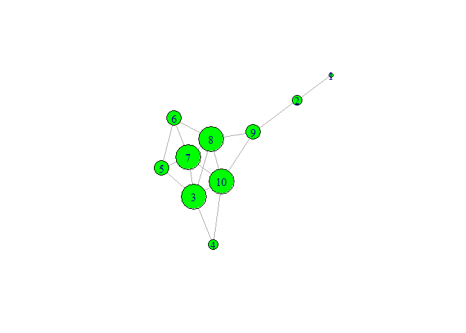

Ex2
================

Load packages

``` r
library(tidyverse)
```

    ## ── Attaching packages ─────────────────────────────────────── tidyverse 1.3.1 ──

    ## ✔ ggplot2 3.3.6     ✔ purrr   0.3.4
    ## ✔ tibble  3.1.7     ✔ dplyr   1.0.9
    ## ✔ tidyr   1.2.0     ✔ stringr 1.4.0
    ## ✔ readr   2.1.2     ✔ forcats 0.5.1

    ## ── Conflicts ────────────────────────────────────────── tidyverse_conflicts() ──
    ## ✖ dplyr::filter() masks stats::filter()
    ## ✖ dplyr::lag()    masks stats::lag()

``` r
library(igraph)
```

    ## 
    ## Attaching package: 'igraph'

    ## The following objects are masked from 'package:dplyr':
    ## 
    ##     as_data_frame, groups, union

    ## The following objects are masked from 'package:purrr':
    ## 
    ##     compose, simplify

    ## The following object is masked from 'package:tidyr':
    ## 
    ##     crossing

    ## The following object is masked from 'package:tibble':
    ## 
    ##     as_data_frame

    ## The following objects are masked from 'package:stats':
    ## 
    ##     decompose, spectrum

    ## The following object is masked from 'package:base':
    ## 
    ##     union

For this assignment, I created an edges list in which the open seats
(A:D) were encoded as an extension of the existing numbers within the
occupied seats. For example, D was encoded as a numeric value of 7, B=8,
A=9, and C=10. After this was done, the finalized edges list could be
uploaded for analysis:

``` r
edges <- read_csv("C:/Users/hedle/OneDrive/McGill - Summer 2022/ORGB 672 - Org Network Analysis/Data/input.csv")
```

    ## Rows: 17 Columns: 2
    ## ── Column specification ────────────────────────────────────────────────────────
    ## Delimiter: ","
    ## dbl (2): source, destination
    ## 
    ## ℹ Use `spec()` to retrieve the full column specification for this data.
    ## ℹ Specify the column types or set `show_col_types = FALSE` to quiet this message.

``` r
View(edges)
```

Here I create a dataframe with distinct values for both the source and
destination seats and rename the columns as ‘label’ to perform a join to
include all unique seat locations.

``` r
sources <- edges %>%
  distinct(source) %>%
  rename(label = source)

destinations <- edges %>%
  distinct(destination) %>%
  rename(label = destination)
```

Create node list:

``` r
nodes <- full_join(sources, destinations, by = "label")
nodes
```

    ## # A tibble: 10 × 1
    ##    label
    ##    <dbl>
    ##  1     1
    ##  2     2
    ##  3     9
    ##  4    10
    ##  5     8
    ##  6     7
    ##  7     3
    ##  8     6
    ##  9     4
    ## 10     5

Create the network object: In this case, we create an undirected graph
as the communication channels from both ‘source’ and ‘destination’ seats
is reciprocal and assumes no inherent direction.

``` r
network <- graph_from_data_frame(d = edges, vertices = nodes, directed = FALSE)
network
```

    ## IGRAPH 48281f1 UN-- 10 17 -- 
    ## + attr: name (v/c)
    ## + edges from 48281f1 (vertex names):
    ##  [1] 1 --2  2 --9  9 --8  9 --10 10--8  10--3  10--4  10--7  8 --7  8 --3 
    ## [11] 7 --5  7 --3  3 --4  3 --5  7 --6  6 --5  8 --6

Plot the network:

``` r
plot(network, edge.arrow.size = 0.2)
```

<!-- --> We can further
enhance the network visualization by plotting the nodes wherein which
their size is a function of their degree centrality. This is a more
intuitive plot as it naturally highlights the most influential nodes.

``` r
degree <- degree(network, v = V(network), mode = c("all"))
degree
```

    ##  1  2  9 10  8  7  3  6  4  5 
    ##  1  2  3  5  5  5  5  3  2  3

``` r
V(network)$size <- (degree*6) 
plot(network, edge.arrow.size = .5, vertex.color = "green") 
```

<!-- --> Compute network
metrics:

Degree Centrality: we can observe that nodes 10, 8, 7, and 3 have the
highest scores degree centrality. Degree centrality is a measure of the
number of adjacent edges to each node, and in this case these particular
nodes would be the ones of greatest influence and the seats that would
be best to sit in as a means to network and improve chances of building
relationships with Facebook colleagues.

``` r
sort(degree(network))
```

    ##  1  2  4  9  6  5 10  8  7  3 
    ##  1  2  2  3  3  3  5  5  5  5

Betweenness: Measures the number of shortest paths between nodes that
pass through a particular node. We can observe that node 9 has the most
influence in channeling information between both segments of the
network. If we observe the graph plot above, we can clearly see that
this node serves as a gateway for both clusters in the network and
should also be considered as a potential seat to maximize communication
and networking chances. This seat may be a preferred option and can be
assessed as a choice to sit in with respect to the other most
influential nodes as outlined in the computations below.

``` r
sort(betweenness(network))
```

    ##          1          4          5          6          7          3          2 
    ##  0.0000000  0.0000000  0.5333333  0.9333333  3.2666667  4.6333333  8.0000000 
    ##         10          8          9 
    ##  8.6000000  9.0333333 14.0000000

Eigenvector centrality: another measure of centrality which furthermore
provides an overview of the relative influence of a particular node
within a network. At a high level, a higher eigenvector score indicates
that a node is connected to many nodes who themselves also have high
scores. We can observe a similar pattern as with the top nodes for the
degree scores, with 10, 3, 8, and 7 all scoring in the top 4 of most
influential nodes.

``` r
sort(eigen_centrality(network)$vector)
```

    ##          1          2          4          9          5          6         10 
    ## 0.03059284 0.12661070 0.46122992 0.49339477 0.62726236 0.62852844 0.94139110 
    ##          3          8          7 
    ## 0.96744261 0.97394849 1.00000000

Page Rank: a variation of Eigenvector centrality which approximates the
probability that any message will arrive to a particular node. The same
most influential nodes can be observed with the scores all yielding
results falling within similar orders of magnitude as per the
eigenvector centrality results.

``` r
sort(page_rank(network)$vector)
```

    ##          1          4          5          6          2          9          7 
    ## 0.05193766 0.06076573 0.08363573 0.08386262 0.08691214 0.09799457 0.13110208 
    ##          3          8         10 
    ## 0.13286649 0.13457929 0.13634370

We can now quickly take a look at the overall network properties to try
to describe some of the characteristics of the graph as a whole.

Diameter: represents the length of the longest path between the two most
distant nodes. This is of interest if we were wanting to see how closely
connected the network is, and as we can see with a diameter of 5, there
are some seats which are very clearly distant from one another and
should be avoided (seats 1, 4, or 5)

``` r
diameter(network, directed=FALSE, weights=NA)
```

    ## [1] 5

We can see the actual path:

``` r
get_diameter(network, directed=FALSE, weights=NA)
```

    ## + 6/10 vertices, named, from 48281f1:
    ## [1] 1  2  9  10 7  5

It is fair to make the conclusion based upon the results obtained from
computing degree centrality, eigenvector centrality, and page rank that
the most optimal location to sit so as to maximize networking
opportunities on the ‘Facebook Bus’ are seats 7, 3, 8, or 10. The
implications of sitting in one of these seats simply means that you
would maximize your chances of engaging in meaningful discussion with
your Facebook colleages and thus improve your chances of securing a full
time position. Seat 9 may also be of interest as this node could
potentially relay information from the two separate clusters in the
network and furthermore improve chances of obtaining valuable
information from a broader range of individuals.
