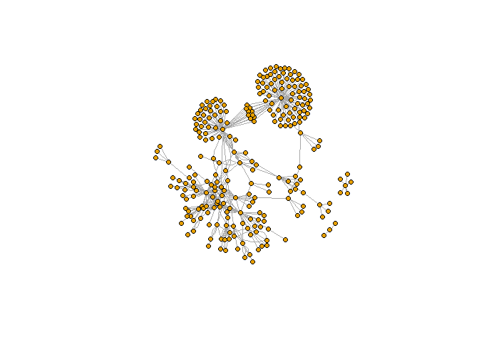

Exercise 3
================

### Load data

``` r
applications <- read_parquet("C:/Users/hedle/OneDrive/McGill - Summer 2022/ORGB 672 - Org Network Analysis/Data/app_data_sample.parquet")
edges <- read_csv("C:/Users/hedle/OneDrive/McGill - Summer 2022/ORGB 672 - Org Network Analysis/Data/edges_sample.csv")
```

    ## Rows: 32906 Columns: 4
    ## ── Column specification ────────────────────────────────────────────────────────
    ## Delimiter: ","
    ## chr  (1): application_number
    ## dbl  (2): ego_examiner_id, alter_examiner_id
    ## date (1): advice_date
    ## 
    ## ℹ Use `spec()` to retrieve the full column specification for this data.
    ## ℹ Specify the column types or set `show_col_types = FALSE` to quiet this message.

``` r
applications
```

    ## # A tibble: 2,018,477 × 16
    ##    application_number filing_date examiner_name_last examiner_name_first
    ##    <chr>              <date>      <chr>              <chr>              
    ##  1 08284457           2000-01-26  HOWARD             JACQUELINE         
    ##  2 08413193           2000-10-11  YILDIRIM           BEKIR              
    ##  3 08531853           2000-05-17  HAMILTON           CYNTHIA            
    ##  4 08637752           2001-07-20  MOSHER             MARY               
    ##  5 08682726           2000-04-10  BARR               MICHAEL            
    ##  6 08687412           2000-04-28  GRAY               LINDA              
    ##  7 08716371           2004-01-26  MCMILLIAN          KARA               
    ##  8 08765941           2000-06-23  FORD               VANESSA            
    ##  9 08776818           2000-02-04  STRZELECKA         TERESA             
    ## 10 08809677           2002-02-20  KIM                SUN                
    ## # … with 2,018,467 more rows, and 12 more variables:
    ## #   examiner_name_middle <chr>, examiner_id <dbl>, examiner_art_unit <dbl>,
    ## #   uspc_class <chr>, uspc_subclass <chr>, patent_number <chr>,
    ## #   patent_issue_date <date>, abandon_date <date>, disposal_type <chr>,
    ## #   appl_status_code <dbl>, appl_status_date <chr>, tc <dbl>

``` r
edges
```

    ## # A tibble: 32,906 × 4
    ##    application_number advice_date ego_examiner_id alter_examiner_id
    ##    <chr>              <date>                <dbl>             <dbl>
    ##  1 09402488           2008-11-17            84356             66266
    ##  2 09402488           2008-11-17            84356             63519
    ##  3 09402488           2008-11-17            84356             98531
    ##  4 09445135           2008-08-21            92953             71313
    ##  5 09445135           2008-08-21            92953             93865
    ##  6 09445135           2008-08-21            92953             91818
    ##  7 09479304           2008-12-15            61767             69277
    ##  8 09479304           2008-12-15            61767             92446
    ##  9 09479304           2008-12-15            61767             66805
    ## 10 09479304           2008-12-15            61767             70919
    ## # … with 32,896 more rows

# Feature engineering

## Get gender for examiners

We’ll get gender based on the first name of the examiner, which is
recorded in the field `examiner_name_first`. We’ll use library `gender`
for that, relying on a modified version of their own
[example](https://cran.r-project.org/web/packages/gender/vignettes/predicting-gender.html).

Note that there are over 2 million records in the applications table –
that’s because there are many records for each examiner, as many as the
number of applications that examiner worked on during this time frame.
Our first step therefore is to get all *unique* names in a separate list
`examiner_names`. We will then guess gender for each one and will join
this table back to the original dataset. So, let’s get names without
repetition:

``` r
# get a list of first names without repetitions
examiner_names <- applications %>% 
  distinct(examiner_name_first)

# get a table of names and gender
examiner_names_gender <- examiner_names %>% 
  do(results = gender(.$examiner_name_first, method = "ssa")) %>% 
  unnest(cols = c(results), keep_empty = TRUE) %>% 
  select(
    examiner_name_first = name,
    gender,
    proportion_female)

# remove extra columns from the gender table
examiner_names_gender <- examiner_names_gender %>% 
  select(examiner_name_first, gender)

# joining gender back to the dataset
applications <- applications %>% 
  left_join(examiner_names_gender, by = "examiner_name_first")

# cleaning up
rm(examiner_names)
rm(examiner_names_gender)
gc()
```

    ##            used  (Mb) gc trigger  (Mb) max used  (Mb)
    ## Ncells  5998578 320.4   10362824 553.5  6276679 335.3
    ## Vcells 52059597 397.2   96830302 738.8 82375380 628.5

## Guess the examiner’s race

We’ll now use package `wru` to estimate likely race of an examiner. Just
like with gender, we’ll get a list of unique names first, only now we
are using surnames.

``` r
# get a distinct dataframe of examiner surnames
examiner_surnames <- applications %>% 
  select(surname = examiner_name_last) %>% 
  distinct()

# apply the predict_race() function to determine examiner's race
examiner_race <- predict_race(voter.file = examiner_surnames, surname.only = T) %>% 
  as_tibble()
```

    ## [1] "Proceeding with surname-only predictions..."

    ## Warning in merge_surnames(voter.file): Probabilities were imputed for 698
    ## surnames that could not be matched to Census list.

``` r
# pick a race category with the highest probability for each last name and assign it respectively 
examiner_race <- examiner_race %>% 
  mutate(max_race_p = pmax(pred.asi, pred.bla, pred.his, pred.oth, pred.whi)) %>% 
  mutate(race = case_when(
    max_race_p == pred.asi ~ "Asian",
    max_race_p == pred.bla ~ "black",
    max_race_p == pred.his ~ "Hispanic",
    max_race_p == pred.oth ~ "other",
    max_race_p == pred.whi ~ "white",
    TRUE ~ NA_character_))

# removing extra columns
examiner_race <- examiner_race %>% 
  select(surname,race)

# join back to original dataframe
applications <- applications %>% 
  left_join(examiner_race, by = c("examiner_name_last" = "surname"))

# cleaning up
rm(examiner_race)
rm(examiner_surnames)
gc()
```

    ##            used  (Mb) gc trigger  (Mb) max used  (Mb)
    ## Ncells  6338196 338.5   10362824 553.5  6989771 373.3
    ## Vcells 55745419 425.4   96830302 738.8 96534381 736.5

## Compute examiner’s tenure

To figure out the timespan for which we observe each examiner in the
applications data, let’s find the first and the last observed date for
each examiner. We’ll first get examiner IDs and application dates in a
separate table, for ease of manipulation. We’ll keep examiner ID (the
field `examiner_id`), and earliest and latest dates for each application
(`filing_date` and `appl_status_date` respectively). We’ll use functions
in package `lubridate` to work with date and time values.

``` r
# consolidate examiner ID's and application dates in separate dataframe
examiner_dates <- applications %>% 
  select(examiner_id, filing_date, appl_status_date) 

# create new variables for examiners start and end date
examiner_dates <- examiner_dates %>% 
  mutate(start_date = ymd(filing_date), end_date = as_date(dmy_hms(appl_status_date)))

# identify earliest and latest dates for examiners and compute the difference 
examiner_dates <- examiner_dates %>% 
  group_by(examiner_id) %>% 
  summarise(
    earliest_date = min(start_date, na.rm = TRUE), 
    latest_date = max(end_date, na.rm = TRUE),
    tenure_days = interval(earliest_date, latest_date) %/% days(1)
    ) %>% 
  filter(year(latest_date)<2018)

# join back to original dataframe
applications <- applications %>% 
  left_join(examiner_dates, by = "examiner_id")

# cleaning up
rm(examiner_dates)
gc()
```

    ##            used  (Mb) gc trigger   (Mb)  max used   (Mb)
    ## Ncells  6352325 339.3   17755324  948.3  17755324  948.3
    ## Vcells 68124252 519.8  140823098 1074.4 140736900 1073.8

# Exploratory Analysis

## Pre-processing for Working Groups

``` r
# isolate the first three digits from examiner_art_unit variable to obtain working groups
applications$examiner_short <- floor(applications$examiner_art_unit/10)

# conduct some intial exploratory analysis of the distribution of working groups
total_count_examiners <- applications %>% 
  count(examiner_short, sort = TRUE)
attach(total_count_examiners)
summary(n)
```

    ##    Min. 1st Qu.  Median    Mean 3rd Qu.    Max. 
    ##      45   31531   51655   53118   75546  141390

``` r
boxplot(n)
```

<!-- -->

``` r
hist(n) 
```

<!-- -->

``` r
# scatter plot to observe total count of examiners by working group
plot <- ggplot(total_count_examiners, aes(y=n, x=examiner_short))
scatter <- geom_point(color='blue')
plot+scatter
```

<!-- -->

``` r
# select the largest working group and a medium sized working group for comparisons  
WG1 <- applications[applications$examiner_short == 212, ] 
WG2 <- applications[applications$examiner_short == 162, ]
# for the sake of simplicity, workgroup 212 will be defined as WG1 and workgroup 162 will be defined as WG2

# drop null observations
WG1 <- drop_na(WG1, gender)
WG2 <- drop_na(WG2, gender)
WG1 <- drop_na(WG1, race)
WG2 <- drop_na(WG2, race)
WG1 <- drop_na(WG1, tenure_days)
WG2 <- drop_na(WG2, tenure_days)

# convert categorical variables to factor 
WG1$gender <- as.factor(WG1$gender)
WG1$race <- as.factor(WG1$race)
WG2$gender <- as.factor(WG2$gender)
WG2$race <- as.factor(WG2$race)
```

### Working groups summary statistics

``` r
summary(WG1)
```

    ##  application_number  filing_date         examiner_name_last examiner_name_first
    ##  Length:41705       Min.   :2000-01-03   Length:41705       Length:41705       
    ##  Class :character   1st Qu.:2004-12-22   Class :character   Class :character   
    ##  Mode  :character   Median :2009-08-31   Mode  :character   Mode  :character   
    ##                     Mean   :2009-02-08                                         
    ##                     3rd Qu.:2013-04-25                                         
    ##                     Max.   :2017-04-13                                         
    ##                                                                                
    ##  examiner_name_middle  examiner_id    examiner_art_unit  uspc_class       
    ##  Length:41705         Min.   :59056   Min.   :2121      Length:41705      
    ##  Class :character     1st Qu.:67321   1st Qu.:2122      Class :character  
    ##  Mode  :character     Median :81049   Median :2125      Mode  :character  
    ##                       Mean   :80702   Mean   :2125                        
    ##                       3rd Qu.:94852   3rd Qu.:2128                        
    ##                       Max.   :99818   Max.   :2129                        
    ##                                                                           
    ##  uspc_subclass      patent_number      patent_issue_date   
    ##  Length:41705       Length:41705       Min.   :2001-03-13  
    ##  Class :character   Class :character   1st Qu.:2007-04-17  
    ##  Mode  :character   Mode  :character   Median :2011-08-09  
    ##                                        Mean   :2010-12-21  
    ##                                        3rd Qu.:2014-06-24  
    ##                                        Max.   :2017-06-20  
    ##                                        NA's   :16677       
    ##   abandon_date        disposal_type      appl_status_code appl_status_date  
    ##  Min.   :1985-10-18   Length:41705       Min.   : 17.0    Length:41705      
    ##  1st Qu.:2007-09-07   Class :character   1st Qu.:150.0    Class :character  
    ##  Median :2010-12-10   Mode  :character   Median :150.0    Mode  :character  
    ##  Mean   :2010-11-21                      Mean   :139.6                      
    ##  3rd Qu.:2014-06-24                      3rd Qu.:161.0                      
    ##  Max.   :2017-06-02                      Max.   :454.0                      
    ##  NA's   :33504                           NA's   :117                        
    ##        tc          gender            race       earliest_date       
    ##  Min.   :2100   female: 6179   Asian   : 8824   Min.   :2000-01-03  
    ##  1st Qu.:2100   male  :35526   black   : 1877   1st Qu.:2000-01-14  
    ##  Median :2100                  Hispanic: 3570   Median :2000-08-28  
    ##  Mean   :2100                  white   :27434   Mean   :2002-01-02  
    ##  3rd Qu.:2100                                   3rd Qu.:2001-10-25  
    ##  Max.   :2100                                   Max.   :2015-03-19  
    ##                                                                     
    ##   latest_date          tenure_days   examiner_short
    ##  Min.   :2002-05-10   Min.   : 519   Min.   :212   
    ##  1st Qu.:2017-05-15   1st Qu.:5617   1st Qu.:212   
    ##  Median :2017-05-19   Median :6075   Median :212   
    ##  Mean   :2017-04-29   Mean   :5596   Mean   :212   
    ##  3rd Qu.:2017-05-22   3rd Qu.:6323   3rd Qu.:212   
    ##  Max.   :2017-05-23   Max.   :6349   Max.   :212   
    ## 

``` r
summary(WG2)
```

    ##  application_number  filing_date         examiner_name_last examiner_name_first
    ##  Length:104445      Min.   :2000-01-03   Length:104445      Length:104445      
    ##  Class :character   1st Qu.:2005-01-31   Class :character   Class :character   
    ##  Mode  :character   Median :2008-12-31   Mode  :character   Mode  :character   
    ##                     Mean   :2008-11-06                                         
    ##                     3rd Qu.:2012-09-13                                         
    ##                     Max.   :2017-04-20                                         
    ##                                                                                
    ##  examiner_name_middle  examiner_id    examiner_art_unit  uspc_class       
    ##  Length:104445        Min.   :59623   Min.   :1621      Length:104445     
    ##  Class :character     1st Qu.:65737   1st Qu.:1624      Class :character  
    ##  Mode  :character     Median :75034   Median :1625      Mode  :character  
    ##                       Mean   :78945   Mean   :1625                        
    ##                       3rd Qu.:94519   3rd Qu.:1626                        
    ##                       Max.   :99794   Max.   :1629                        
    ##                                                                           
    ##  uspc_subclass      patent_number      patent_issue_date   
    ##  Length:104445      Length:104445      Min.   :2000-08-08  
    ##  Class :character   Class :character   1st Qu.:2006-10-17  
    ##  Mode  :character   Mode  :character   Median :2011-06-07  
    ##                                        Mean   :2010-07-10  
    ##                                        3rd Qu.:2014-03-25  
    ##                                        Max.   :2017-06-20  
    ##                                        NA's   :43597       
    ##   abandon_date        disposal_type      appl_status_code appl_status_date  
    ##  Min.   :2000-07-20   Length:104445      Min.   :  1.0    Length:104445     
    ##  1st Qu.:2009-03-26   Class :character   1st Qu.:150.0    Class :character  
    ##  Median :2011-07-26   Mode  :character   Median :150.0    Mode  :character  
    ##  Mean   :2011-02-22                      Mean   :160.8                      
    ##  3rd Qu.:2013-10-04                      3rd Qu.:161.0                      
    ##  Max.   :2017-06-05                      Max.   :454.0                      
    ##  NA's   :71034                           NA's   :175                        
    ##        tc          gender            race       earliest_date       
    ##  Min.   :1600   female:50971   Asian   :16453   Min.   :2000-01-03  
    ##  1st Qu.:1600   male  :53474   black   : 2518   1st Qu.:2000-01-07  
    ##  Median :1600                  Hispanic: 2945   Median :2000-03-10  
    ##  Mean   :1600                  white   :82529   Mean   :2001-08-19  
    ##  3rd Qu.:1600                                   3rd Qu.:2003-02-10  
    ##  Max.   :1600                                   Max.   :2012-07-25  
    ##                                                                     
    ##   latest_date          tenure_days   examiner_short
    ##  Min.   :2004-09-01   Min.   : 847   Min.   :162   
    ##  1st Qu.:2017-05-19   1st Qu.:5211   1st Qu.:162   
    ##  Median :2017-05-22   Median :6081   Median :162   
    ##  Mean   :2017-04-30   Mean   :5733   Mean   :162   
    ##  3rd Qu.:2017-05-23   3rd Qu.:6338   3rd Qu.:162   
    ##  Max.   :2017-11-08   Max.   :6518   Max.   :162   
    ## 

## Summarize Race Distribution by Working Group

``` r
# obtain raw count and percentage of race by working group
WG1_Race <- WG1 %>%
  group_by(race) %>%
  summarise(WG = "Work Group 1", count = n()) %>%
  mutate(percentage  = round(count / sum(count), 2)) %>% 
  arrange(desc(percentage))
head(WG1_Race)
```

    ## # A tibble: 4 × 4
    ##   race     WG           count percentage
    ##   <fct>    <chr>        <int>      <dbl>
    ## 1 white    Work Group 1 27434       0.66
    ## 2 Asian    Work Group 1  8824       0.21
    ## 3 Hispanic Work Group 1  3570       0.09
    ## 4 black    Work Group 1  1877       0.05

``` r
WG2_Race <- WG2 %>%
  group_by(race) %>%
  summarise(WG = "Work Group 2", count = n()) %>%
  mutate(percentage = round(count / sum(count), 2)) %>% 
  arrange(desc(percentage))
head(WG2_Race)
```

    ## # A tibble: 4 × 4
    ##   race     WG           count percentage
    ##   <fct>    <chr>        <int>      <dbl>
    ## 1 white    Work Group 2 82529       0.79
    ## 2 Asian    Work Group 2 16453       0.16
    ## 3 Hispanic Work Group 2  2945       0.03
    ## 4 black    Work Group 2  2518       0.02

### Visualization of Race by Working Group

We can explore the distribution of race by both raw counts and the
relative percentages. As we will see, the raw counts are not as useful
to draw inference given the size variance between both working groups,
with WG2 being over two times larger.

``` r
# visualization of race by working group as a function of percentage
comps_perc <- rbind(WG1_Race, WG2_Race)
ggplot(comps_perc, aes(x=race, y=percentage, fill=WG)) + geom_bar(stat="identity", position="dodge")
```

<!-- -->

``` r
# visualization of race by working group as a function of raw counts
comps_raw <- rbind(WG1_Race, WG2_Race)
ggplot(comps_raw, aes(x=race, y=count, fill=WG)) + geom_bar(stat="identity", position="dodge")
```

<!-- -->

## Summarize Gender Distribution by Working Group

``` r
# obtain raw count and percentage of gender by working group
WG1_Gender <- WG1 %>%
  group_by(gender) %>%
  summarise(WG = "Work Group 1", count = n()) %>%
  mutate(percentage = round(count / sum(count), 2)) %>% 
  arrange(desc(percentage))
head(WG1_Gender)
```

    ## # A tibble: 2 × 4
    ##   gender WG           count percentage
    ##   <fct>  <chr>        <int>      <dbl>
    ## 1 male   Work Group 1 35526       0.85
    ## 2 female Work Group 1  6179       0.15

``` r
WG2_Gender <- WG2 %>%
  group_by(gender) %>%
  summarise(WG = "Work Group 2", count = n()) %>%
  mutate(percentage = round(count / sum(count), 2)) %>% 
  arrange(desc(percentage))
head(WG2_Gender)
```

    ## # A tibble: 2 × 4
    ##   gender WG           count percentage
    ##   <fct>  <chr>        <int>      <dbl>
    ## 1 male   Work Group 2 53474       0.51
    ## 2 female Work Group 2 50971       0.49

### Visualization of Gender by Working Group

``` r
# visualization of gender by working group as a function of percentage
comps_perc <- rbind(WG1_Gender, WG2_Gender)
ggplot(comps_perc, aes(x=gender, y=percentage, fill=WG)) + geom_bar(stat="identity", position="dodge")
```

<!-- -->

``` r
# visualization of gender by working group as a function of raw counts
comps_raw <- rbind(WG1_Gender, WG2_Gender)
ggplot(comps_raw, aes(x=gender, y=count, fill=WG)) + geom_bar(stat="identity", position="dodge")
```

<!-- -->

## Summarize Examiner Tenure by Race and Gender

``` r
# generate new variable which looks at average tenure days by race and gender
WG1_GenderRace <- WG1 %>%
   group_by(gender, race) %>% 
   summarise_at(vars("tenure_days"), mean)
WG2_GenderRace <- WG2 %>%
   group_by(gender, race) %>% 
   summarise_at(vars("tenure_days"), mean)

# generate a new variable to describe the workgroups
WG1_GenderRace$WG <- "Work Group 1"
WG2_GenderRace$WG <- "Work Group 2"

# rename gender for more clear visualization
WG1_GenderRace <- WG1_GenderRace %>%
    mutate(gender = recode(gender, female = "FM", male = "ML"))
WG2_GenderRace <- WG2_GenderRace %>%
    mutate(gender = recode(gender, female = "FM", male = "ML"))

# create new variable that is a combination of both 
WG1_GenderRace$gender_race <- paste(WG1_GenderRace$gender, WG1_GenderRace$race)
WG2_GenderRace$gender_race <- paste(WG2_GenderRace$gender, WG2_GenderRace$race)
```

### Visualization of Tenure by Working Group, Race and Gender

``` r
aggregate <- rbind(WG1_GenderRace, WG2_GenderRace)
ggplot(aggregate, aes(x=gender_race, y=tenure_days, fill=WG)) + geom_bar(stat="identity", position="dodge")
```

<!-- -->

An interesting observation is that there is a large discrepancy between
the **average tenure days** for black females between WG1 and WG2.

# Network Analysis

## Nodes

### Create node dataframe

We must first merge the edges dataframe with each respective work group
and then define both node lists separately:

``` r
# drop the nulls in the edges dataframe 
edges <- drop_na(edges, ego_examiner_id)
edges <-drop_na(edges, alter_examiner_id)

# merge original edges dataframe with both workgroups 
FULLWG1 <- inner_join(WG1, edges, by = "application_number", copy = FALSE) 
FULLWG2 <- inner_join(WG2, edges, by = "application_number", copy = FALSE) 

# generate a nodes dataframe for WG1 for both the ego_examiner_id and alter_examiner_id 
WG1_nodes_ego <- FULLWG1 %>% 
  distinct(ego_examiner_id) %>%
  rename(ID = ego_examiner_id)
WG1_nodes_alter <- FULLWG1 %>% 
  distinct(alter_examiner_id) %>%
  rename(ID = alter_examiner_id)

# perform a union of both dataframes to create a final node list and filter for unique nodes only 
WG1_FinalNodes <- union_all(WG1_nodes_ego, WG1_nodes_alter)
WG1_FinalNodes <- unique(WG1_FinalNodes)

# do the same for WG2
WG2_nodes_ego <- FULLWG2 %>% 
  distinct(ego_examiner_id) %>%
  rename(ID = ego_examiner_id)
WG2_nodes_alter <- FULLWG2 %>% 
  distinct(alter_examiner_id) %>%
  rename(ID = alter_examiner_id)

WG2_FinalNodes <- union_all(WG2_nodes_ego, WG2_nodes_alter)
WG2_FinalNodes <- unique(WG2_FinalNodes)
```

## Edges

### Create a clean edges dataframe

``` r
# rename the applicants id variables in both groups 
WG1_Edges <- FULLWG1 %>% 
  select(ego_examiner_id, alter_examiner_id) %>% 
  rename(From = ego_examiner_id, To = alter_examiner_id) 

WG2_Edges <- FULLWG2 %>% 
  select(ego_examiner_id, alter_examiner_id) %>% 
  rename(From = ego_examiner_id, To = alter_examiner_id) 
```

We have a total of 542 edges for WG1 and 326 edges for WG2.

## Graphs

### Initialize Graphs

``` r
# create graph objects for both workgroups
WG1_network <- graph_from_data_frame(d = WG1_Edges, vertices = WG1_FinalNodes, directed = FALSE)

WG2_network <- graph_from_data_frame(d = WG2_Edges, vertices = WG2_FinalNodes, directed = FALSE)
```

## Visualize the Networks

``` r
# regular networks 
plot(WG1_network, edge.arrow.size = 0.2, vertex.size= 5,vertex.label=NA)
```

<!-- -->

``` r
plot(WG2_network, edge.arrow.size = 0.2, vertex.size= 5,vertex.label=NA)
```

<!-- -->

``` r
# visualize network based on degree
WG1_degree <- degree(WG1_network, v = V(WG1_network), mode = c("all"))
WG2_degree <- degree(WG2_network, v = V(WG2_network), mode = c("all"))

# assign degree value to nodes
V(WG1_network)$size <- (WG1_degree) 
plot(WG1_network, edge.arrow.size = .5, vertex.color = "green", vertex.label=NA) 
```

<!-- -->

``` r
V(WG2_network)$size <- (WG2_degree) 
plot(WG2_network, edge.arrow.size = .5, vertex.color = "blue",vertex.label=NA)
```

<!-- -->

We can see at a high level that there are a few extremely influential
nodes across both graphs just based on degree. Lets explore a few
different layout types to see if any further patterns can be identified:

``` r
plot(WG1_network, layout=layout.sphere, main="sphere", vertex.label=NA, vertex.size= 5, vertex.color = "blue" )
```

<!-- -->

``` r
plot(WG2_network, layout=layout.sphere, main="sphere", vertex.label=NA, vertex.size= 5, vertex.color = "blue" )
```

<!-- -->

``` r
plot(WG1_network, layout=layout.random, main="random", vertex.label=NA, vertex.size= 5, vertex.color = "red")
```

<!-- -->

``` r
plot(WG2_network, layout=layout.random, main="random", vertex.label=NA, vertex.size= 5, vertex.color = "red")
```

<!-- -->

``` r
plot(WG1_network, layout=layout.fruchterman.reingold, main="fruchterman.reingold", vertex.label=NA, vertex.size= 5, vertex.color = "yellow")
```

<!-- -->

``` r
plot(WG2_network, layout=layout.fruchterman.reingold, main="fruchterman.reingold", vertex.label=NA, vertex.size= 5, vertex.color = "yellow")
```

<!-- -->

## Graph Metrics

To begin the analysis, we can first compute the most commonly used
centrality scores for both graphs and then move on to a more advanced
method of determining which centrality measure to use:

``` r
# WG1
WG1_degree <- sort(degree(WG1_network))
WG1_betweenness <- sort(betweenness(WG1_network))
WG1_eigen <- sort(eigen_centrality(WG1_network)$vector)
WG1_pagerank <- sort(page_rank(WG1_network)$vector)

# WG2
WG2_degree <- sort(degree(WG2_network))
WG2_betweenness <- sort(betweenness(WG2_network))
WG2_eigen <- sort(eigen_centrality(WG2_network)$vector)
WG2_pagerank <- sort(page_rank(WG2_network)$vector)

# join them all together
WG1_compare <- cbind(WG1_degree, WG1_betweenness, WG1_eigen, WG1_pagerank)
WG2_compare <- cbind(WG2_degree, WG2_betweenness, WG2_eigen, WG2_pagerank)

# convert back to dataframe
WG1_compare <- as.data.frame(WG1_compare) 
WG2_compare <- as.data.frame(WG2_compare) 

# only look at the top 5 in each work group
WG1_top <- WG1_compare %>% top_n(5)
```

    ## Selecting by WG1_pagerank

``` r
WG2_top <- WG2_compare %>% top_n(5)
```

    ## Selecting by WG2_pagerank

``` r
WG1_top
```

    ##       WG1_degree WG1_betweenness WG1_eigen WG1_pagerank
    ## 61026         42        5263.543 0.2533750   0.01950814
    ## 86109         53        6067.205 0.4621694   0.02545145
    ## 69889         59       11395.918 0.6294204   0.02675251
    ## 93875         84       15832.982 0.6558160   0.06868868
    ## 96438         85       19149.187 1.0000000   0.13588317

``` r
WG2_top
```

    ##       WG2_degree WG2_betweenness WG2_eigen WG2_pagerank
    ## 69138         17        1378.000 0.2711689   0.02446049
    ## 88832         20        1570.408 0.2711689   0.03473693
    ## 95446         34        2763.685 0.2750534   0.04423114
    ## 70767         47        3616.507 0.3314286   0.09526030
    ## 67690        135        3641.113 1.0000000   0.11043025

For the sake of simplicity, we can turn our attention only to the **top
most influential nodes** for both workgroups and observe their
characteristics:

``` r
WG1final_top_node <- (FULLWG1[FULLWG1$ego_examiner_id == 96438, ])
WG1final_top_node[1, ] 
```

    ## # A tibble: 1 × 25
    ##   application_number filing_date examiner_name_last examiner_name_first
    ##   <chr>              <date>      <chr>              <chr>              
    ## 1 10566307           2006-01-27  LAUGHLIN           NATHAN             
    ## # … with 21 more variables: examiner_name_middle <chr>, examiner_id <dbl>,
    ## #   examiner_art_unit <dbl>, uspc_class <chr>, uspc_subclass <chr>,
    ## #   patent_number <chr>, patent_issue_date <date>, abandon_date <date>,
    ## #   disposal_type <chr>, appl_status_code <dbl>, appl_status_date <chr>,
    ## #   tc <dbl>, gender <fct>, race <fct>, earliest_date <date>,
    ## #   latest_date <date>, tenure_days <dbl>, examiner_short <dbl>,
    ## #   advice_date <date>, ego_examiner_id <dbl>, alter_examiner_id <dbl>

``` r
WG2final_top_node <- (FULLWG2[FULLWG2$ego_examiner_id == 67690, ])
WG2final_top_node[1, ] 
```

    ## # A tibble: 1 × 25
    ##   application_number filing_date examiner_name_last examiner_name_first
    ##   <chr>              <date>      <chr>              <chr>              
    ## 1 09879854           2001-06-12  MCINTOSH III       TRAVISS            
    ## # … with 21 more variables: examiner_name_middle <chr>, examiner_id <dbl>,
    ## #   examiner_art_unit <dbl>, uspc_class <chr>, uspc_subclass <chr>,
    ## #   patent_number <chr>, patent_issue_date <date>, abandon_date <date>,
    ## #   disposal_type <chr>, appl_status_code <dbl>, appl_status_date <chr>,
    ## #   tc <dbl>, gender <fct>, race <fct>, earliest_date <date>,
    ## #   latest_date <date>, tenure_days <dbl>, examiner_short <dbl>,
    ## #   advice_date <date>, ego_examiner_id <dbl>, alter_examiner_id <dbl>

We can see that the examiners who scored the highest across all of the
computed cetrality metrics were both **white males** with over 5,500
days of tenure.

## Picking the Best Centrality Measure

while there are many types of centrality measures available to determine
the most influential nodes within a network, there is no established
consensus in network science pertaining to a methodology for selecting
and implementing the best tailored measure for a given network
*(Ashtiani, 2018)*. On top of this, the topographic anatomy and features
for every network will affect the output of centrality computations, and
as such, one must select criteria which contains the highest level of
information about the influential nodes based on the unique structure of
each network.

To advance in our understanding of how to select the most optimal
centrality measure given these aforementioned considerations, the
package [CINNA](https://cran.r-project.org/web/packages/CINNA/CINNA.pdf)
provides a few useful functions to assess which centrality measure to
select.

For the purpose of this analysis, we will only look at one of the
workgroups in isolation and draw inference for the other based on the
results of the first since the overall structure is fairly consistent
across both graphs as this approach is quite time consuming. Some
requirement for using several of the main functions within this package
is that the network is fully connected and un-directed. Since our both
networks for WG1 and WG2 have disconnected components, we have to first
isolate a fully connected network and can use the largest connected
component to so, as this would fairly accurately reflect the
relationships between most nodes.

### Isolating WG1 Largest Connected Component

``` r
# determine the largest connected component 
components <- igraph::clusters(WG1_network, mode="weak")
biggest_cluster_id <- which.max(components$csize)

# assign it to its own variable
vert_ids <- V(WG1_network)[components$membership == biggest_cluster_id]

# create subgraph 
WG1largest_component <- igraph::induced_subgraph(WG1_network, vert_ids)
```

To calculate the centrality types based on the graph structure, we can
use the proper_centralities() function which outputs a list of 49
popular centrality metrics specific to an undirected-unweighted graphs.
We can then select the first five centrality measures from the list and
then pass them to the calculate_centralities() function since running
all 49 measures would take several days.

We can then use the **Principle Component Analysis** algorithm to be
able to distinguish the most informative centrality metric from the
selected options. In this process, each centrality measure serves as a
variable and the overall contribution criterion from the PCA highlights
how much each measure contributes to their respective principal
components. This means that the relative contribution of variables
accounts for the variability with respect to their principal components.
As a result of being able to identify this criteria in the PCA method,
we are able to detect which centrality measures contain the most
information about each central node and thus be able to ascertain the
most influential nodes more accurately based on the inherent network
structure for this particular connected component for WG1. We can see
the *sorted contribution* of the selected centrality metrics as below,
using the pipe operator to apply the aforementioned steps:

``` r
# assign centrality metrics to WG1's largest connected component
WG1_centrality <- proper_centralities(WG1largest_component)
```

    ##  [1] "subgraph centrality scores"                      
    ##  [2] "Topological Coefficient"                         
    ##  [3] "Average Distance"                                
    ##  [4] "Barycenter Centrality"                           
    ##  [5] "BottleNeck Centrality"                           
    ##  [6] "Centroid value"                                  
    ##  [7] "Closeness Centrality (Freeman)"                  
    ##  [8] "ClusterRank"                                     
    ##  [9] "Decay Centrality"                                
    ## [10] "Degree Centrality"                               
    ## [11] "Diffusion Degree"                                
    ## [12] "DMNC - Density of Maximum Neighborhood Component"
    ## [13] "Eccentricity Centrality"                         
    ## [14] "Harary Centrality"                               
    ## [15] "eigenvector centralities"                        
    ## [16] "K-core Decomposition"                            
    ## [17] "Geodesic K-Path Centrality"                      
    ## [18] "Katz Centrality (Katz Status Index)"             
    ## [19] "Kleinberg's authority centrality scores"         
    ## [20] "Kleinberg's hub centrality scores"               
    ## [21] "clustering coefficient"                          
    ## [22] "Lin Centrality"                                  
    ## [23] "Lobby Index (Centrality)"                        
    ## [24] "Markov Centrality"                               
    ## [25] "Radiality Centrality"                            
    ## [26] "Shortest-Paths Betweenness Centrality"           
    ## [27] "Current-Flow Closeness Centrality"               
    ## [28] "Closeness centrality (Latora)"                   
    ## [29] "Communicability Betweenness Centrality"          
    ## [30] "Community Centrality"                            
    ## [31] "Cross-Clique Connectivity"                       
    ## [32] "Entropy Centrality"                              
    ## [33] "EPC - Edge Percolated Component"                 
    ## [34] "Laplacian Centrality"                            
    ## [35] "Leverage Centrality"                             
    ## [36] "MNC - Maximum Neighborhood Component"            
    ## [37] "Hubbell Index"                                   
    ## [38] "Semi Local Centrality"                           
    ## [39] "Closeness Vitality"                              
    ## [40] "Residual Closeness Centrality"                   
    ## [41] "Stress Centrality"                               
    ## [42] "Load Centrality"                                 
    ## [43] "Flow Betweenness Centrality"                     
    ## [44] "Information Centrality"                          
    ## [45] "Dangalchev Closeness Centrality"                 
    ## [46] "Group Centrality"                                
    ## [47] "Harmonic Centrality"                             
    ## [48] "Local Bridging Centrality"                       
    ## [49] "Wiener Index Centrality"

``` r
# apply PCA method to determine which metric is most important in identifying the central nodes 
calculate_centralities(WG1largest_component, include = WG1_centrality[1:5])%>%
  pca_centralities(scale.unit = TRUE)
```

<!-- --> We can
observe that the sub-graph centrality measure has the most contribution
from among the chosen 4 centrality indices, again, meaning that it
contains the most information about the influential nodes from the
selected metrics and thus can be used to determine central nodes
influence more accurately than any other chosen metric.

Let us now compute the sub-graph centrality scores for the entire graph
for both WG1 and WG2. The limitation with this approach is that it does
not account for some of the most commonly used metrics, which to
reiterate was limited due to the computationally exhaustive nature of
this method. This particular centrality measure at a high level is “a
weighted sum of the numbers of all closed walks of different lengths in
the network starting and ending at the node.”:
[CentiServer](https://www.centiserver.org/centrality/Subgraph_Centrality/#:~:text=Subgraph%20centrality%20(SC)%20of%20a,and%20ending%20at%20the%20node.)

``` r
# compute subgraph centrality
WG1subgraph <- sort(subgraph_centrality(WG1_network, diag = FALSE))
WG2subgraph <- sort(subgraph_centrality(WG2_network, diag = FALSE))

# top nodes
head(WG1subgraph, 1)
```

    ##    68558 
    ## 1.589092

``` r
head(WG2subgraph, 1)
```

    ##    65537 
    ## 1.543081

If we were to go back and observe where these nodes sit with respect to
the original centrality metric scores, we can see that the relative
scope of influence both fall within the middle of the each respective
work group. The results of this final analysis using PCA are not
entirely conclusive as the structure of work group graphs were
disjointed and thus had to be broken up to explore the limited selection
of centrality metrics from the large list of 49 metrics. Further
examination is warranted, perhaps on a working group that is more
integrated, to finalize the recommendations as to how to identify the
most appropriate centrality metric and its corresponding most
influential nodes.
