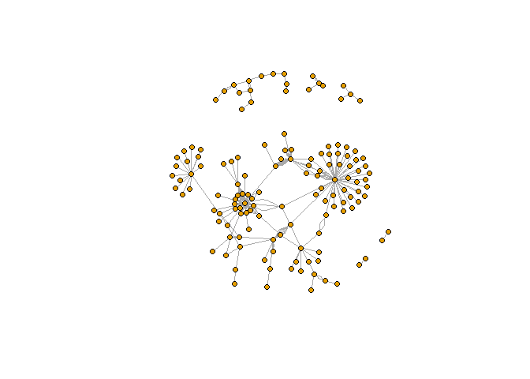
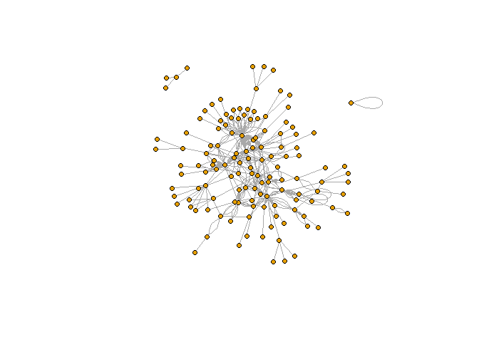
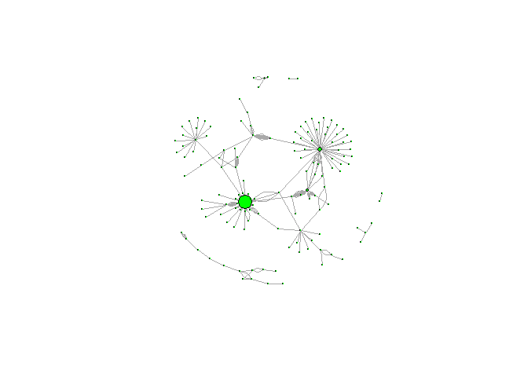
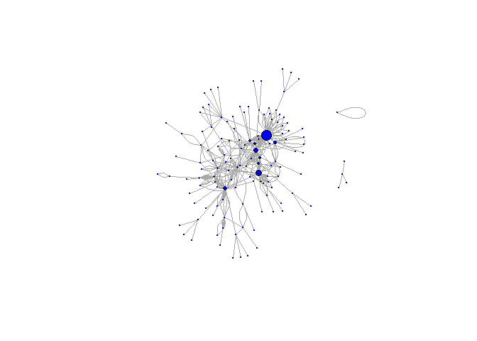
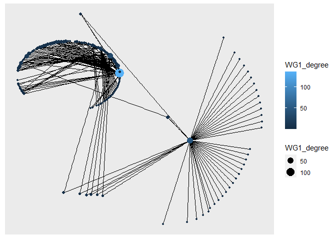
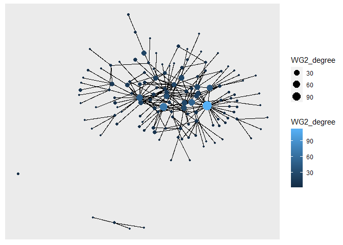
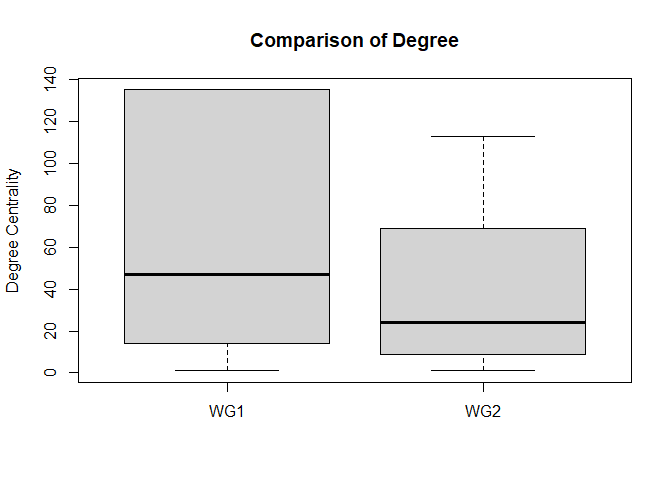
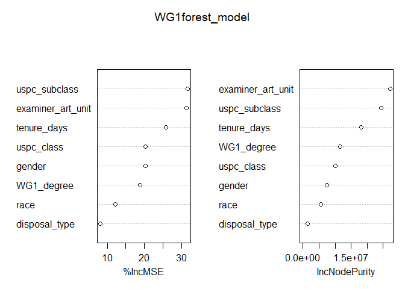
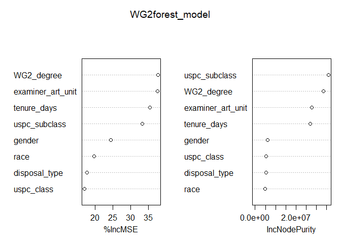

Exercise 4
================

### Load data

``` r
applications <- read_parquet("C:/Users/hedle/OneDrive/McGill - Summer 2022/ORGB 672 - Org Network Analysis/Data/app_data_sample.parquet")
edges <- read_csv("C:/Users/hedle/OneDrive/McGill - Summer 2022/ORGB 672 - Org Network Analysis/Data/edges_sample.csv")
```

    ## Rows: 32906 Columns: 4
    ## ── Column specification ────────────────────────────────────────────────────────
    ## Delimiter: ","
    ## chr  (1): application_number
    ## dbl  (2): ego_examiner_id, alter_examiner_id
    ## date (1): advice_date
    ## 
    ## ℹ Use `spec()` to retrieve the full column specification for this data.
    ## ℹ Specify the column types or set `show_col_types = FALSE` to quiet this message.

``` r
applications
```

    ## # A tibble: 2,018,477 × 16
    ##    application_number filing_date examiner_name_last examiner_name_first
    ##    <chr>              <date>      <chr>              <chr>              
    ##  1 08284457           2000-01-26  HOWARD             JACQUELINE         
    ##  2 08413193           2000-10-11  YILDIRIM           BEKIR              
    ##  3 08531853           2000-05-17  HAMILTON           CYNTHIA            
    ##  4 08637752           2001-07-20  MOSHER             MARY               
    ##  5 08682726           2000-04-10  BARR               MICHAEL            
    ##  6 08687412           2000-04-28  GRAY               LINDA              
    ##  7 08716371           2004-01-26  MCMILLIAN          KARA               
    ##  8 08765941           2000-06-23  FORD               VANESSA            
    ##  9 08776818           2000-02-04  STRZELECKA         TERESA             
    ## 10 08809677           2002-02-20  KIM                SUN                
    ## # … with 2,018,467 more rows, and 12 more variables:
    ## #   examiner_name_middle <chr>, examiner_id <dbl>, examiner_art_unit <dbl>,
    ## #   uspc_class <chr>, uspc_subclass <chr>, patent_number <chr>,
    ## #   patent_issue_date <date>, abandon_date <date>, disposal_type <chr>,
    ## #   appl_status_code <dbl>, appl_status_date <chr>, tc <dbl>

``` r
edges
```

    ## # A tibble: 32,906 × 4
    ##    application_number advice_date ego_examiner_id alter_examiner_id
    ##    <chr>              <date>                <dbl>             <dbl>
    ##  1 09402488           2008-11-17            84356             66266
    ##  2 09402488           2008-11-17            84356             63519
    ##  3 09402488           2008-11-17            84356             98531
    ##  4 09445135           2008-08-21            92953             71313
    ##  5 09445135           2008-08-21            92953             93865
    ##  6 09445135           2008-08-21            92953             91818
    ##  7 09479304           2008-12-15            61767             69277
    ##  8 09479304           2008-12-15            61767             92446
    ##  9 09479304           2008-12-15            61767             66805
    ## 10 09479304           2008-12-15            61767             70919
    ## # … with 32,896 more rows

Create a new variable which is a combination of both the issue date and
the abandon date

``` r
# Create a new variable which is a combination of both the issue date and the abandon date
applications <- applications %>% mutate(combined = coalesce(patent_issue_date,abandon_date))

# compute difference in days 
applications$app_proc_time<- as.numeric(difftime(applications$combined, applications$filing_date , units = c("days")))
```

# Feature engineering

## Get gender for examiners

We’ll get gender based on the first name of the examiner, which is
recorded in the field `examiner_name_first`. We’ll use library `gender`
for that, relying on a modified version of their own
[example](https://cran.r-project.org/web/packages/gender/vignettes/predicting-gender.html).

Note that there are over 2 million records in the applications table –
that’s because there are many records for each examiner, as many as the
number of applications that examiner worked on during this time frame.
Our first step therefore is to get all *unique* names in a separate list
`examiner_names`. We will then guess gender for each one and will join
this table back to the original dataset. So, let’s get names without
repetition:

``` r
# get a list of first names without repetitions
examiner_names <- applications %>% 
  distinct(examiner_name_first)

# get a table of names and gender
examiner_names_gender <- examiner_names %>% 
  do(results = gender(.$examiner_name_first, method = "ssa")) %>% 
  unnest(cols = c(results), keep_empty = TRUE) %>% 
  select(
    examiner_name_first = name,
    gender,
    proportion_female)

# remove extra columns from the gender table
examiner_names_gender <- examiner_names_gender %>% 
  select(examiner_name_first, gender)

# joining gender back to the dataset
applications <- applications %>% 
  left_join(examiner_names_gender, by = "examiner_name_first")

# cleaning up
rm(examiner_names)
rm(examiner_names_gender)
gc()
```

    ##            used  (Mb) gc trigger  (Mb) max used  (Mb)
    ## Ncells  6033615 322.3   10462002 558.8  6291952 336.1
    ## Vcells 56139525 428.4  100956302 770.3 90492334 690.5

## Guess the examiner’s race

We’ll now use package `wru` to estimate likely race of an examiner. Just
like with gender, we’ll get a list of unique names first, only now we
are using surnames.

``` r
# get a distinct dataframe of examiner surnames
examiner_surnames <- applications %>% 
  select(surname = examiner_name_last) %>% 
  distinct()

# apply the predict_race() function to determine examiner's race
examiner_race <- predict_race(voter.file = examiner_surnames, surname.only = T) %>% 
  as_tibble()
```

    ## [1] "Proceeding with surname-only predictions..."

    ## Warning in merge_surnames(voter.file): Probabilities were imputed for 698
    ## surnames that could not be matched to Census list.

``` r
# pick a race category with the highest probability for each last name and assign it respectively 
examiner_race <- examiner_race %>% 
  mutate(max_race_p = pmax(pred.asi, pred.bla, pred.his, pred.oth, pred.whi)) %>% 
  mutate(race = case_when(
    max_race_p == pred.asi ~ "Asian",
    max_race_p == pred.bla ~ "black",
    max_race_p == pred.his ~ "Hispanic",
    max_race_p == pred.oth ~ "other",
    max_race_p == pred.whi ~ "white",
    TRUE ~ NA_character_))

# removing extra columns
examiner_race <- examiner_race %>% 
  select(surname,race)

# join back to original dataframe
applications <- applications %>% 
  left_join(examiner_race, by = c("examiner_name_last" = "surname"))

# cleaning up
rm(examiner_race)
rm(examiner_surnames)
gc()
```

    ##            used  (Mb) gc trigger  (Mb)  max used  (Mb)
    ## Ncells  6373152 340.4   10462002 558.8   7024875 375.2
    ## Vcells 59825204 456.5  100956302 770.3 100613721 767.7

## Compute examiner’s tenure

To figure out the timespan for which we observe each examiner in the
applications data, let’s find the first and the last observed date for
each examiner. We’ll first get examiner IDs and application dates in a
separate table, for ease of manipulation. We’ll keep examiner ID (the
field `examiner_id`), and earliest and latest dates for each application
(`filing_date` and `appl_status_date` respectively). We’ll use functions
in package `lubridate` to work with date and time values.

``` r
# consolidate examiner ID's and application dates in separate dataframe
examiner_dates <- applications %>% 
  select(examiner_id, filing_date, appl_status_date) 

# create new variables for examiners start and end date
examiner_dates <- examiner_dates %>% 
  mutate(start_date = ymd(filing_date), end_date = as_date(dmy_hms(appl_status_date)))

# identify earliest and latest dates for examiners and compute the difference 
examiner_dates <- examiner_dates %>% 
  group_by(examiner_id) %>% 
  summarise(
    earliest_date = min(start_date, na.rm = TRUE), 
    latest_date = max(end_date, na.rm = TRUE),
    tenure_days = interval(earliest_date, latest_date) %/% days(1)
    ) %>% 
  filter(year(latest_date)<2018)

# join back to original dataframe
applications <- applications %>% 
  left_join(examiner_dates, by = "examiner_id")

# cleaning up
rm(examiner_dates)
gc()
```

    ##            used  (Mb) gc trigger   (Mb)  max used   (Mb)
    ## Ncells  6387222 341.2   17787450  950.0  17787450  950.0
    ## Vcells 72203929 550.9  146687583 1119.2 146436191 1117.3

``` r
# isolate the first three digits from examiner_art_unit variable to obtain working groups
applications$examiner_short <- floor(applications$examiner_art_unit/10)

# select the largest working group and a medium sized working group for comparisons  
WG1 <- applications[applications$examiner_short == 162, ] 
WG2 <- applications[applications$examiner_short == 219, ]
# for the sake of simplicity, workgroup 212 will be defined as WG1 and workgroup 162 will be defined as WG2

# drop null observations
WG1 <- drop_na(WG1, gender)
WG2 <- drop_na(WG2, gender)
WG1 <- drop_na(WG1, race)
WG2 <- drop_na(WG2, race)
WG1 <- drop_na(WG1, tenure_days)
WG2 <- drop_na(WG2, tenure_days)

# convert categorical variables to factor 
WG1$gender <- as.factor(WG1$gender)
WG1$race <- as.factor(WG1$race)
WG2$gender <- as.factor(WG2$gender)
WG2$race <- as.factor(WG2$race)
```

# Network Analysis

## Nodes

### Create node dataframe

We must first merge the edges dataframe with each respective work group
and then define both node lists separately:

``` r
# drop the nulls in the edges dataframe 
edges <- drop_na(edges, ego_examiner_id)
edges <- drop_na(edges, alter_examiner_id)

# merge original edges dataframe with both workgroups 
FULLWG1 <- inner_join(WG1, edges, by = "application_number", copy = FALSE) 
FULLWG2 <- inner_join(WG2, edges, by = "application_number", copy = FALSE) 

# remove extra nulls 
FULLWG1 %>% skim()
```

|                                                  |            |
|:-------------------------------------------------|:-----------|
| Name                                             | Piped data |
| Number of rows                                   | 326        |
| Number of columns                                | 27         |
| \_\_\_\_\_\_\_\_\_\_\_\_\_\_\_\_\_\_\_\_\_\_\_   |            |
| Column type frequency:                           |            |
| character                                        | 9          |
| Date                                             | 7          |
| factor                                           | 2          |
| numeric                                          | 9          |
| \_\_\_\_\_\_\_\_\_\_\_\_\_\_\_\_\_\_\_\_\_\_\_\_ |            |
| Group variables                                  | None       |

Data summary

**Variable type: character**

| skim_variable        | n_missing | complete_rate | min | max | empty | n_unique | whitespace |
|:---------------------|----------:|--------------:|----:|----:|------:|---------:|-----------:|
| application_number   |         0 |          1.00 |   8 |   8 |     0 |      111 |          0 |
| examiner_name_last   |         0 |          1.00 |   2 |  16 |     0 |       29 |          0 |
| examiner_name_first  |         0 |          1.00 |   4 |   8 |     0 |       29 |          0 |
| examiner_name_middle |        39 |          0.88 |   1 |   9 |     0 |       19 |          0 |
| uspc_class           |         0 |          1.00 |   3 |   3 |     0 |       12 |          0 |
| uspc_subclass        |         0 |          1.00 |   6 |   6 |     0 |       82 |          0 |
| patent_number        |        37 |          0.89 |   7 |   7 |     0 |       85 |          0 |
| disposal_type        |         0 |          1.00 |   3 |   4 |     0 |        3 |          0 |
| appl_status_date     |         0 |          1.00 |  18 |  18 |     0 |       94 |          0 |

**Variable type: Date**

| skim_variable     | n_missing | complete_rate | min        | max        | median     | n_unique |
|:------------------|----------:|--------------:|:-----------|:-----------|:-----------|---------:|
| filing_date       |         0 |          1.00 | 2000-11-01 | 2008-02-21 | 2005-03-31 |      105 |
| patent_issue_date |        37 |          0.89 | 2008-05-20 | 2016-04-05 | 2009-01-27 |       62 |
| abandon_date      |       292 |          0.10 | 2008-04-17 | 2016-04-25 | 2009-06-27 |       23 |
| combined          |         3 |          0.99 | 2008-04-17 | 2016-04-25 | 2009-02-19 |       83 |
| earliest_date     |         0 |          1.00 | 2000-01-03 | 2004-01-30 | 2000-02-15 |       24 |
| latest_date       |         0 |          1.00 | 2016-07-01 | 2017-11-08 | 2017-05-19 |        8 |
| advice_date       |         0 |          1.00 | 2008-01-03 | 2008-12-29 | 2008-06-26 |       90 |

**Variable type: factor**

| skim_variable | n_missing | complete_rate | ordered | n_unique | top_counts                        |
|:--------------|----------:|--------------:|:--------|---------:|:----------------------------------|
| gender        |         0 |             1 | FALSE   |        2 | mal: 213, fem: 113                |
| race          |         0 |             1 | FALSE   |        3 | whi: 287, Asi: 36, His: 3, bla: 0 |

**Variable type: numeric**

| skim_variable     | n_missing | complete_rate |     mean |       sd |    p0 |      p25 |   p50 |   p75 |  p100 | hist  |
|:------------------|----------:|--------------:|---------:|---------:|------:|---------:|------:|------:|------:|:------|
| examiner_id       |         0 |          1.00 | 73522.85 | 11499.17 | 60302 | 67690.00 | 67690 | 73364 | 99424 | ▇▃▁▁▂ |
| examiner_art_unit |         0 |          1.00 |  1623.96 |     1.69 |  1621 |  1623.00 |  1623 |  1625 |  1629 | ▁▇▂▂▁ |
| appl_status_code  |         0 |          1.00 |   167.77 |    39.47 |    30 |   150.00 |   150 |   161 |   250 | ▁▁▇▁▂ |
| tc                |         0 |          1.00 |  1600.00 |     0.00 |  1600 |  1600.00 |  1600 |  1600 |  1600 | ▁▁▇▁▁ |
| app_proc_time     |         3 |          0.99 |  1657.88 |   723.27 |   421 |  1033.00 |  1623 |  2071 |  4261 | ▇▇▃▃▁ |
| tenure_days       |         0 |          1.00 |  6132.29 |   359.92 |  4858 |  6060.75 |  6303 |  6339 |  6518 | ▁▁▁▁▇ |
| examiner_short    |         0 |          1.00 |   162.00 |     0.00 |   162 |   162.00 |   162 |   162 |   162 | ▁▁▇▁▁ |
| ego_examiner_id   |         0 |          1.00 | 75006.72 | 11749.52 | 60302 | 67690.00 | 67690 | 88832 | 99424 | ▇▃▁▁▃ |
| alter_examiner_id |         0 |          1.00 | 76105.59 | 12544.73 | 60377 | 66206.00 | 71259 | 87486 | 99191 | ▇▇▂▁▆ |

``` r
FULLWG2 %>% skim()
```

|                                                  |            |
|:-------------------------------------------------|:-----------|
| Name                                             | Piped data |
| Number of rows                                   | 495        |
| Number of columns                                | 27         |
| \_\_\_\_\_\_\_\_\_\_\_\_\_\_\_\_\_\_\_\_\_\_\_   |            |
| Column type frequency:                           |            |
| character                                        | 9          |
| Date                                             | 7          |
| factor                                           | 2          |
| numeric                                          | 9          |
| \_\_\_\_\_\_\_\_\_\_\_\_\_\_\_\_\_\_\_\_\_\_\_\_ |            |
| Group variables                                  | None       |

Data summary

**Variable type: character**

| skim_variable        | n_missing | complete_rate | min | max | empty | n_unique | whitespace |
|:---------------------|----------:|--------------:|----:|----:|------:|---------:|-----------:|
| application_number   |         0 |          1.00 |   8 |   8 |     0 |      277 |          0 |
| examiner_name_last   |         0 |          1.00 |   2 |  10 |     0 |       42 |          0 |
| examiner_name_first  |         0 |          1.00 |   2 |   8 |     0 |       41 |          0 |
| examiner_name_middle |       171 |          0.65 |   1 |   9 |     0 |       22 |          0 |
| uspc_class           |         0 |          1.00 |   3 |   3 |     0 |        7 |          0 |
| uspc_subclass        |         0 |          1.00 |   6 |   6 |     0 |       95 |          0 |
| patent_number        |       134 |          0.73 |   7 |   7 |     0 |      209 |          0 |
| disposal_type        |         0 |          1.00 |   3 |   3 |     0 |        2 |          0 |
| appl_status_date     |         0 |          1.00 |  18 |  18 |     0 |      206 |          0 |

**Variable type: Date**

| skim_variable     | n_missing | complete_rate | min        | max        | median     | n_unique |
|:------------------|----------:|--------------:|:-----------|:-----------|:-----------|---------:|
| filing_date       |         0 |          1.00 | 2000-01-24 | 2008-06-30 | 2004-05-17 |      229 |
| patent_issue_date |       134 |          0.73 | 2008-03-25 | 2014-04-22 | 2009-06-09 |      124 |
| abandon_date      |       361 |          0.27 | 2008-04-30 | 2015-09-10 | 2009-09-05 |       66 |
| combined          |         0 |          1.00 | 2008-03-25 | 2015-09-10 | 2009-07-20 |      180 |
| earliest_date     |         0 |          1.00 | 2000-01-03 | 2005-06-08 | 2001-07-23 |       38 |
| latest_date       |         0 |          1.00 | 2013-04-19 | 2017-05-23 | 2017-05-19 |       15 |
| advice_date       |         0 |          1.00 | 2008-01-02 | 2008-12-30 | 2008-06-09 |      160 |

**Variable type: factor**

| skim_variable | n_missing | complete_rate | ordered | n_unique | top_counts                         |
|:--------------|----------:|--------------:|:--------|---------:|:-----------------------------------|
| gender        |         0 |             1 | FALSE   |        2 | mal: 309, fem: 186                 |
| race          |         0 |             1 | FALSE   |        4 | Asi: 327, whi: 158, bla: 6, His: 4 |

**Variable type: numeric**

| skim_variable     | n_missing | complete_rate |     mean |       sd |    p0 |     p25 |   p50 |   p75 |  p100 | hist  |
|:------------------|----------:|--------------:|---------:|---------:|------:|--------:|------:|------:|------:|:------|
| examiner_id       |         0 |             1 | 74737.83 | 10865.16 | 59491 | 65943.5 | 75399 | 76141 | 99346 | ▇▇▃▂▂ |
| examiner_art_unit |         0 |             1 |  2192.54 |     1.46 |  2191 |  2192.0 |  2192 |  2193 |  2199 | ▇▃▁▁▁ |
| appl_status_code  |         0 |             1 |   173.22 |    38.58 |   150 |   150.0 |   150 |   163 |   250 | ▇▁▁▁▂ |
| tc                |         0 |             1 |  2100.00 |     0.00 |  2100 |  2100.0 |  2100 |  2100 |  2100 | ▁▁▇▁▁ |
| app_proc_time     |         0 |             1 |  2053.66 |   663.41 |   225 |  1672.0 |  1968 |  2546 |  4297 | ▁▇▇▃▁ |
| tenure_days       |         0 |             1 |  5749.68 |   561.95 |  3133 |  5601.0 |  5780 |  6242 |  6349 | ▁▁▁▅▇ |
| examiner_short    |         0 |             1 |   219.00 |     0.00 |   219 |   219.0 |   219 |   219 |   219 | ▁▁▇▁▁ |
| ego_examiner_id   |         0 |             1 | 82263.11 | 12958.40 | 59491 | 71996.0 | 87028 | 96206 | 99346 | ▅▃▃▆▇ |
| alter_examiner_id |         0 |             1 | 79837.85 | 13100.27 | 59203 | 69002.0 | 82083 | 92028 | 99577 | ▇▇▃▆▇ |

``` r
# generate a nodes dataframe for WG1 for both the ego_examiner_id and alter_examiner_id 
WG1_nodes_ego <- FULLWG1 %>% 
  distinct(ego_examiner_id) %>%
  rename(ID = ego_examiner_id)
WG1_nodes_alter <- FULLWG1 %>% 
  distinct(alter_examiner_id) %>%
  rename(ID = alter_examiner_id)

# perform a union of both dataframes to create a final node list and filter for unique nodes only 
WG1_FinalNodes <- union_all(WG1_nodes_ego, WG1_nodes_alter)
WG1_FinalNodes <- unique(WG1_FinalNodes)

# do the same for WG2
WG2_nodes_ego <- FULLWG2 %>% 
  distinct(ego_examiner_id) %>%
  rename(ID = ego_examiner_id)
WG2_nodes_alter <- FULLWG2 %>% 
  distinct(alter_examiner_id) %>%
  rename(ID = alter_examiner_id)

WG2_FinalNodes <- union_all(WG2_nodes_ego, WG2_nodes_alter)
WG2_FinalNodes <- unique(WG2_FinalNodes)
```

## Edges

### Create a clean edges dataframe

``` r
# rename the applicants id variables in both groups 
WG1_Edges <- FULLWG1 %>% 
  select(ego_examiner_id, alter_examiner_id) %>% 
  rename(From = ego_examiner_id, To = alter_examiner_id) 

WG2_Edges <- FULLWG2 %>% 
  select(ego_examiner_id, alter_examiner_id) %>% 
  rename(From = ego_examiner_id, To = alter_examiner_id) 
```

### Initialize Graphs

``` r
# create graph objects for both workgroups
WG1_network <- graph_from_data_frame(d = WG1_Edges, vertices = WG1_FinalNodes, directed = FALSE)

WG2_network <- graph_from_data_frame(d = WG2_Edges, vertices = WG2_FinalNodes, directed = FALSE)
```

## Visualize the Networks

``` r
# regular networks 
plot(WG1_network, edge.arrow.size = 0.2, vertex.size= 5,vertex.label=NA)
```

<!-- -->

``` r
plot(WG2_network, edge.arrow.size = 0.2, vertex.size= 5,vertex.label=NA)
```

<!-- -->

``` r
# visualize network based on degree
WG1_degree <- degree(WG1_network, v = V(WG1_network), mode = c("all"))
WG2_degree <- degree(WG2_network, v = V(WG2_network), mode = c("all"))

# assign degree value to nodes
V(WG1_network)$size <- (WG1_degree*0.1) 
plot(WG1_network, edge.arrow.size = .5, vertex.color = "green", vertex.label=NA) 
```

<!-- -->

``` r
V(WG2_network)$size <- (WG2_degree*0.1) 
plot(WG2_network, edge.arrow.size = .5, vertex.color = "blue",vertex.label=NA)
```

<!-- -->

``` r
# another type of visualization using ggraph
ggraph(WG1_network, layout="kk")+ 
 geom_edge_link()+
  geom_node_point(aes(size = WG1_degree, colour = WG1_degree))
```

<!-- -->

``` r
ggraph(WG2_network, layout="kk")+ 
 geom_edge_link()+
  geom_node_point(aes(size = WG2_degree, colour = WG2_degree))
```

<!-- -->

# Regression Analysis

## Degree centrality join

``` r
# convert vector to dataframe
WG1_degree <- as.data.frame(WG1_degree) 
WG2_degree <- as.data.frame(WG2_degree) 

# assign index as a new column to merge with original WG dataframe
WG1_degree <- cbind(ego_examiner_id = rownames(WG1_degree), WG1_degree)
rownames(WG1_degree) <- 1:nrow(WG1_degree)
WG2_degree <- cbind(ego_examiner_id = rownames(WG2_degree), WG2_degree)
rownames(WG2_degree) <- 1:nrow(WG2_degree)
```

``` r
# convert examiner_id into numeric to perform merge with original dataframe
WG1_degree <- WG1_degree %>% mutate(across(where(is.character), as.numeric))
WG2_degree <- WG2_degree %>% mutate(across(where(is.character), as.numeric))
typeof(WG1_degree$ego_examiner_id)
```

    ## [1] "double"

``` r
# merge degree centrality with WG dataframes  
WG1Final <- left_join(FULLWG1, WG1_degree, by = "ego_examiner_id", copy = TRUE)  
WG2Final <- left_join(FULLWG2, WG2_degree, by = "ego_examiner_id", copy = TRUE)  
```

## Overview of Degree Centrality for Both WG’s

``` r
boxplot(WG1Final$WG1_degree,WG2Final$WG2_degree,main = "Comparison of Degree", ylab = "Degree Centrality", names = c("WG1", "WG2"))
```

<!-- -->

## Simple linear regression

Run linear regression to highlight patterns between centrality and
app_proc_time:

``` r
WG1_reg <- lm(app_proc_time~WG1_degree, data = WG1Final)
summary(WG1_reg)
```

    ## 
    ## Call:
    ## lm(formula = app_proc_time ~ WG1_degree, data = WG1Final)
    ## 
    ## Residuals:
    ##      Min       1Q   Median       3Q      Max 
    ## -1261.51  -599.33    -9.33   393.59  2576.53 
    ## 
    ## Coefficients:
    ##              Estimate Std. Error t value Pr(>|t|)    
    ## (Intercept) 1685.2493    63.8644  26.388   <2e-16 ***
    ## WG1_degree    -0.3920     0.7096  -0.552    0.581    
    ## ---
    ## Signif. codes:  0 '***' 0.001 '**' 0.01 '*' 0.05 '.' 0.1 ' ' 1
    ## 
    ## Residual standard error: 724 on 321 degrees of freedom
    ##   (3 observations deleted due to missingness)
    ## Multiple R-squared:  0.0009497,  Adjusted R-squared:  -0.002163 
    ## F-statistic: 0.3051 on 1 and 321 DF,  p-value: 0.5811

``` r
WG2_reg <- lm(app_proc_time~WG2_degree, data = WG2Final)
summary(WG2_reg)
```

    ## 
    ## Call:
    ## lm(formula = app_proc_time ~ WG2_degree, data = WG2Final)
    ## 
    ## Residuals:
    ##      Min       1Q   Median       3Q      Max 
    ## -1714.14  -371.14   -84.14   379.48  2276.53 
    ## 
    ## Coefficients:
    ##              Estimate Std. Error t value Pr(>|t|)    
    ## (Intercept) 1915.9054    42.0278  45.587  < 2e-16 ***
    ## WG2_degree     3.8727     0.8488   4.563 6.39e-06 ***
    ## ---
    ## Signif. codes:  0 '***' 0.001 '**' 0.01 '*' 0.05 '.' 0.1 ' ' 1
    ## 
    ## Residual standard error: 650.5 on 493 degrees of freedom
    ## Multiple R-squared:  0.04051,    Adjusted R-squared:  0.03857 
    ## F-statistic: 20.82 on 1 and 493 DF,  p-value: 6.385e-06

## Control for other variables which may influence the relationship

Take a quick look at the dataset again:

``` r
str(WG1Final)
```

    ## tibble [326 × 28] (S3: tbl_df/tbl/data.frame)
    ##  $ application_number  : chr [1:326] "09704054" "09704054" "09714351" "09714351" ...
    ##  $ filing_date         : Date[1:326], format: "2000-11-01" "2000-11-01" ...
    ##  $ examiner_name_last  : chr [1:326] "ANDERSON" "ANDERSON" "STOCKTON" "STOCKTON" ...
    ##  $ examiner_name_first : chr [1:326] "JAMES" "JAMES" "LAURA" "LAURA" ...
    ##  $ examiner_name_middle: chr [1:326] "D" "D" "LYNNE" "LYNNE" ...
    ##  $ examiner_id         : num [1:326] 73364 73364 61417 61417 61417 ...
    ##  $ examiner_art_unit   : num [1:326] 1629 1629 1626 1626 1626 ...
    ##  $ uspc_class          : chr [1:326] "514" "514" "548" "548" ...
    ##  $ uspc_subclass       : chr [1:326] "323000" "323000" "537000" "537000" ...
    ##  $ patent_number       : chr [1:326] "8143283" "8143283" "7411075" "7411075" ...
    ##  $ patent_issue_date   : Date[1:326], format: "2012-03-27" "2012-03-27" ...
    ##  $ abandon_date        : Date[1:326], format: NA NA ...
    ##  $ disposal_type       : chr [1:326] "ISS" "ISS" "ISS" "ISS" ...
    ##  $ appl_status_code    : num [1:326] 250 250 250 250 250 250 250 250 250 250 ...
    ##  $ appl_status_date    : chr [1:326] "22apr2016 00:00:00" "22apr2016 00:00:00" "09sep2016 00:00:00" "09sep2016 00:00:00" ...
    ##  $ tc                  : num [1:326] 1600 1600 1600 1600 1600 1600 1600 1600 1600 1600 ...
    ##  $ combined            : Date[1:326], format: "2012-03-27" "2012-03-27" ...
    ##  $ app_proc_time       : num [1:326] 4164 4164 2826 2826 2826 ...
    ##  $ gender              : Factor w/ 2 levels "female","male": 2 2 1 1 1 2 2 2 2 2 ...
    ##  $ race                : Factor w/ 4 levels "Asian","black",..: 4 4 4 4 4 4 4 4 4 4 ...
    ##  $ earliest_date       : Date[1:326], format: "2000-10-20" "2000-10-20" ...
    ##  $ latest_date         : Date[1:326], format: "2017-05-22" "2017-05-22" ...
    ##  $ tenure_days         : num [1:326] 6058 6058 6342 6342 6342 ...
    ##  $ examiner_short      : num [1:326] 162 162 162 162 162 162 162 162 162 162 ...
    ##  $ advice_date         : Date[1:326], format: "2008-06-12" "2008-06-12" ...
    ##  $ ego_examiner_id     : num [1:326] 73364 73364 61417 61417 61417 ...
    ##  $ alter_examiner_id   : num [1:326] 72814 98081 82244 72004 83224 ...
    ##  $ WG1_degree          : num [1:326] 5 5 10 10 10 135 135 135 135 135 ...

``` r
# since we do not have a clear data dictionary for this dataset, we can run a quick correlation check to confirm that numeric features do not exhibit collinearity 
quantvars <- WG1Final[, c(7, 8, 9, 10,14,18,23,28)]
quantvars <- quantvars %>% mutate(across(where(is.character), as.numeric))
corr_matrix=cor(quantvars)
round(corr_matrix,2)
```

    ##                   examiner_art_unit uspc_class uspc_subclass patent_number
    ## examiner_art_unit              1.00       0.03          0.27            NA
    ## uspc_class                     0.03       1.00          0.21            NA
    ## uspc_subclass                  0.27       0.21          1.00            NA
    ## patent_number                    NA         NA            NA             1
    ## appl_status_code               0.12      -0.14         -0.11            NA
    ## app_proc_time                    NA         NA            NA            NA
    ## tenure_days                   -0.48      -0.01         -0.18            NA
    ## WG1_degree                    -0.50      -0.09         -0.62            NA
    ##                   appl_status_code app_proc_time tenure_days WG1_degree
    ## examiner_art_unit             0.12            NA       -0.48      -0.50
    ## uspc_class                   -0.14            NA       -0.01      -0.09
    ## uspc_subclass                -0.11            NA       -0.18      -0.62
    ## patent_number                   NA            NA          NA         NA
    ## appl_status_code              1.00            NA        0.13      -0.18
    ## app_proc_time                   NA             1          NA         NA
    ## tenure_days                   0.13            NA        1.00       0.41
    ## WG1_degree                   -0.18            NA        0.41       1.00

We can observe that there is no observable collinearity between the
quantitative features within this dataset, so we can proceed to join and
experiment with various combinations.

## Random Forest Feature Importance

Let us run a random forest feature importance to observe which of the
other variables may be helpful in explaining processing times and then
experiment with different combinations, including interaction terms with
degree centrality.

``` r
# only focus on important variables
WG1forest_model <- randomForest(app_proc_time~examiner_art_unit+uspc_class+uspc_subclass+disposal_type + gender + race + tenure_days + WG1_degree, ntree=500, data=WG1Final, importance=TRUE, na.action = na.omit)
WG1forest_model
```

    ## 
    ## Call:
    ##  randomForest(formula = app_proc_time ~ examiner_art_unit + uspc_class +      uspc_subclass + disposal_type + gender + race + tenure_days +      WG1_degree, data = WG1Final, ntree = 500, importance = TRUE,      na.action = na.omit) 
    ##                Type of random forest: regression
    ##                      Number of trees: 500
    ## No. of variables tried at each split: 2
    ## 
    ##           Mean of squared residuals: 226706.1
    ##                     % Var explained: 56.53

``` r
importance(WG1forest_model)
```

    ##                     %IncMSE IncNodePurity
    ## examiner_art_unit 31.276056      27075125
    ## uspc_class        20.287629      10090562
    ## uspc_subclass     31.584662      24430799
    ## disposal_type      8.195074       1503950
    ## gender            20.246668       7495084
    ## race              12.139436       5491446
    ## tenure_days       25.735304      18181934
    ## WG1_degree        18.798245      11527906

``` r
varImpPlot(WG1forest_model)
```

<!-- -->

We can see a large improvement in performance using this tree-based
model for WG1 and including a few more features from with an r-squared
value increasing from 0.0009497 to 55.85. From these results, it seems
that broader technology centers under which certain working groups
resides seem to have a larger influence in determining the number of
days to abandon or finalize a patent, perhaps indicating that some TC’s
are more efficient at processing patents. The relative positioning of an
examiner within the network, as expressed by their degree score is
fourth most important when looking at trying to understand the features
which influence processing times, which we will come back to in the
final conclusions.

Looking at this increase in performance we can safely infer that the
out-of-bag predictions for this random forest model explain the variance
of app_proc_time of the training set much better than when running our
initial simple regression. Let’s look at WG2 and then include some of
other terms back into our initial regression model:

``` r
# only focus on important variables
WG2forest_model <- randomForest(app_proc_time~examiner_art_unit+uspc_class+uspc_subclass+disposal_type + gender + race + tenure_days + WG2_degree, ntree=500, data=WG2Final, importance=TRUE, na.action = na.omit)
WG2forest_model
```

    ## 
    ## Call:
    ##  randomForest(formula = app_proc_time ~ examiner_art_unit + uspc_class +      uspc_subclass + disposal_type + gender + race + tenure_days +      WG2_degree, data = WG2Final, ntree = 500, importance = TRUE,      na.action = na.omit) 
    ##                Type of random forest: regression
    ##                      Number of trees: 500
    ## No. of variables tried at each split: 2
    ## 
    ##           Mean of squared residuals: 231723.2
    ##                     % Var explained: 47.24

``` r
importance(WG2forest_model)
```

    ##                    %IncMSE IncNodePurity
    ## examiner_art_unit 37.60861      27796067
    ## uspc_class        17.06023       5351176
    ## uspc_subclass     33.38365      35882636
    ## disposal_type     17.72128       5287507
    ## gender            24.46258       6018827
    ## race              19.67115       4774748
    ## tenure_days       35.50682      26975230
    ## WG2_degree        37.72808      33612829

``` r
varImpPlot(WG2forest_model)
```

<!-- -->

## Multiple regression

Now lets run our multiple regression model and observe the results when
including more features:

``` r
WG1_reg2 <- lm(app_proc_time~examiner_art_unit+uspc_class+uspc_subclass+as.factor(disposal_type) + gender + race + tenure_days + WG1_degree, data = WG1Final)
summary(WG1_reg2)
```

    ## 
    ## Call:
    ## lm(formula = app_proc_time ~ examiner_art_unit + uspc_class + 
    ##     uspc_subclass + as.factor(disposal_type) + gender + race + 
    ##     tenure_days + WG1_degree, data = WG1Final)
    ## 
    ## Residuals:
    ##    Min     1Q Median     3Q    Max 
    ## -680.9    0.0    0.0    0.0 1084.1 
    ## 
    ## Coefficients: (9 not defined because of singularities)
    ##                               Estimate Std. Error t value Pr(>|t|)    
    ## (Intercept)                 69161.3021 93301.3261   0.741 0.459274    
    ## examiner_art_unit             -39.2186    57.0191  -0.688 0.492250    
    ## uspc_class435                  26.4210   924.0271   0.029 0.977213    
    ## uspc_class514                -531.7882   380.5630  -1.397 0.163625    
    ## uspc_class540               -1474.5022   597.8490  -2.466 0.014368 *  
    ## uspc_class546               -1013.9175   907.8870  -1.117 0.265230    
    ## uspc_class548               -2241.7994   485.5215  -4.617 6.41e-06 ***
    ## uspc_class558               -2368.3283   790.4186  -2.996 0.003027 ** 
    ## uspc_class560               -1494.7767   900.1474  -1.661 0.098135 .  
    ## uspc_class562               -1546.5398  1023.6677  -1.511 0.132193    
    ## uspc_class564               -3537.5531   812.9258  -4.352 2.02e-05 ***
    ## uspc_class568               -2225.9689   711.9728  -3.126 0.001993 ** 
    ## uspc_class585               -2253.7802   669.7350  -3.365 0.000894 ***
    ## uspc_subclass008000           486.0000   528.2317   0.920 0.358494    
    ## uspc_subclass023000           282.4724   804.4978   0.351 0.725817    
    ## uspc_subclass025000           744.2092   842.3960   0.883 0.377903    
    ## uspc_subclass027000           834.0811   797.9542   1.045 0.296975    
    ## uspc_subclass032000                 NA         NA      NA       NA    
    ## uspc_subclass042000          1481.2092   882.8297   1.678 0.094722 .  
    ## uspc_subclass047000          1911.2092   806.1260   2.371 0.018558 *  
    ## uspc_subclass049000          1054.6798   805.0345   1.310 0.191445    
    ## uspc_subclass050000            -0.8241   743.8616  -0.001 0.999117    
    ## uspc_subclass055000          1168.2092   842.3960   1.387 0.166832    
    ## uspc_subclass058000          -985.7517   607.7601  -1.622 0.106162    
    ## uspc_subclass070100         -1668.0333   487.4677  -3.422 0.000734 ***
    ## uspc_subclass111000           286.6832   772.7735   0.371 0.710988    
    ## uspc_subclass112000           935.5958   860.3895   1.087 0.277975    
    ## uspc_subclass119000          -471.4695   648.0834  -0.727 0.467658    
    ## uspc_subclass125000          -779.0000   528.2317  -1.475 0.141629    
    ## uspc_subclass129000         -1452.5401   672.5565  -2.160 0.031810 *  
    ## uspc_subclass133000         -1314.7065   590.7823  -2.225 0.027011 *  
    ## uspc_subclass134000                 NA         NA      NA       NA    
    ## uspc_subclass159000          1106.5148   798.8316   1.385 0.167321    
    ## uspc_subclass178000           -99.5223  1034.0430  -0.096 0.923408    
    ## uspc_subclass183000          1008.2646   795.2655   1.268 0.206117    
    ## uspc_subclass210000          -249.7065   528.4567  -0.473 0.636996    
    ## uspc_subclass211130            62.5230   675.1524   0.093 0.926296    
    ## uspc_subclass216000          -843.7140   504.7609  -1.672 0.095957 .  
    ## uspc_subclass217000          -812.0000   528.2317  -1.537 0.125594    
    ## uspc_subclass221000          -650.5469   462.9629  -1.405 0.161293    
    ## uspc_subclass232000           -63.0000   528.2317  -0.119 0.905167    
    ## uspc_subclass241000                 NA         NA      NA       NA    
    ## uspc_subclass243000         -1892.5951   681.2456  -2.778 0.005911 ** 
    ## uspc_subclass247000           375.2092   882.8297   0.425 0.671222    
    ## uspc_subclass250000                 NA         NA      NA       NA    
    ## uspc_subclass252100          -463.5761   710.6870  -0.652 0.514852    
    ## uspc_subclass253060         -2197.8701   571.7318  -3.844 0.000156 ***
    ## uspc_subclass253070         -2187.8701   571.7318  -3.827 0.000167 ***
    ## uspc_subclass254010            96.9523   946.0960   0.102 0.918466    
    ## uspc_subclass256000          -757.2428   421.8802  -1.795 0.073956 .  
    ## uspc_subclass257000          -674.7140   481.1769  -1.402 0.162176    
    ## uspc_subclass260000          1017.8482   680.3558   1.496 0.135987    
    ## uspc_subclass270000           180.2092   806.6013   0.223 0.823405    
    ## uspc_subclass274000            72.9291   613.3853   0.119 0.905460    
    ## uspc_subclass278000           -55.4461   726.0959  -0.076 0.939196    
    ## uspc_subclass279000           -55.4461   726.0959  -0.076 0.939196    
    ## uspc_subclass310000          1395.2646   795.2655   1.754 0.080660 .  
    ## uspc_subclass318000          -701.0918   622.8373  -1.126 0.261470    
    ## uspc_subclass322000         -1445.7498   691.0042  -2.092 0.037495 *  
    ## uspc_subclass323000          1615.4410   587.1029   2.752 0.006396 ** 
    ## uspc_subclass332000         -1676.8358   601.2793  -2.789 0.005726 ** 
    ## uspc_subclass338000           -58.0477   946.0960  -0.061 0.951129    
    ## uspc_subclass339000          -204.4695   648.0834  -0.315 0.752664    
    ## uspc_subclass342000         -1115.4965   470.9313  -2.369 0.018664 *  
    ## uspc_subclass343000         -1908.8358   618.4367  -3.087 0.002269 ** 
    ## uspc_subclass367000            96.2646   795.2655   0.121 0.903758    
    ## uspc_subclass369000          -446.3031   797.6910  -0.559 0.576360    
    ## uspc_subclass372000          2532.0054   748.4676   3.383 0.000841 ***
    ## uspc_subclass376000         -2124.5951   681.2456  -3.119 0.002044 ** 
    ## uspc_subclass400000           846.1727   773.9283   1.093 0.275365    
    ## uspc_subclass401000         -1406.4965   470.9313  -2.987 0.003121 ** 
    ## uspc_subclass405000           330.9515   944.9647   0.350 0.726484    
    ## uspc_subclass414000         -1622.6805   554.2619  -2.928 0.003752 ** 
    ## uspc_subclass423000           512.9277   895.0410   0.573 0.567143    
    ## uspc_subclass442000                 NA         NA      NA       NA    
    ## uspc_subclass458000          1049.7159   795.3513   1.320 0.188187    
    ## uspc_subclass464000          -154.8926   749.0336  -0.207 0.836354    
    ## uspc_subclass466000          1341.1647   998.3383   1.343 0.180445    
    ## uspc_subclass468000          -367.4461   726.0959  -0.506 0.613293    
    ## uspc_subclass483000           -86.8695   724.5611  -0.120 0.904671    
    ## uspc_subclass489000          1453.1647   998.3383   1.456 0.146848    
    ## uspc_subclass534000           746.2646   750.1267   0.995 0.320836    
    ## uspc_subclass535000           179.7630   589.2451   0.305 0.760581    
    ## uspc_subclass537000          1554.5148   738.3241   2.105 0.036317 *  
    ## uspc_subclass539000          1590.1190   681.0277   2.335 0.020396 *  
    ## uspc_subclass548000           493.0000   528.2317   0.933 0.351626    
    ## uspc_subclass557000           281.2370   344.0310   0.817 0.414488    
    ## uspc_subclass568000                 NA         NA      NA       NA    
    ## uspc_subclass593000                 NA         NA      NA       NA    
    ## uspc_subclass620000                 NA         NA      NA       NA    
    ## uspc_subclass649000         -1742.9289   784.9371  -2.220 0.027346 *  
    ## uspc_subclass769000          1154.0277   708.7711   1.628 0.104826    
    ## as.factor(disposal_type)ISS   392.2370   261.1151   1.502 0.134404    
    ## gendermale                   -741.6302   399.5635  -1.856 0.064696 .  
    ## raceHispanic                        NA         NA      NA       NA    
    ## racewhite                    1542.5274   464.7411   3.319 0.001047 ** 
    ## tenure_days                    -0.5818     0.2398  -2.426 0.016021 *  
    ## WG1_degree                    -12.3234     3.8554  -3.196 0.001583 ** 
    ## ---
    ## Signif. codes:  0 '***' 0.001 '**' 0.01 '*' 0.05 '.' 0.1 ' ' 1
    ## 
    ## Residual standard error: 373.5 on 234 degrees of freedom
    ##   (3 observations deleted due to missingness)
    ## Multiple R-squared:  0.8062, Adjusted R-squared:  0.7333 
    ## F-statistic: 11.06 on 88 and 234 DF,  p-value: < 2.2e-16

``` r
WG2_reg2 <- lm(app_proc_time~examiner_art_unit+uspc_class+uspc_subclass+as.factor(disposal_type) + gender + race + tenure_days + WG2_degree, data = WG2Final)
summary(WG2_reg2)
```

    ## 
    ## Call:
    ## lm(formula = app_proc_time ~ examiner_art_unit + uspc_class + 
    ##     uspc_subclass + as.factor(disposal_type) + gender + race + 
    ##     tenure_days + WG2_degree, data = WG2Final)
    ## 
    ## Residuals:
    ##     Min      1Q  Median      3Q     Max 
    ## -1704.7  -165.9     0.0   156.4  2068.2 
    ## 
    ## Coefficients: (2 not defined because of singularities)
    ##                               Estimate Std. Error t value Pr(>|t|)    
    ## (Intercept)                 -4.603e+05  4.882e+04  -9.430  < 2e-16 ***
    ## examiner_art_unit            2.100e+02  2.220e+01   9.458  < 2e-16 ***
    ## uspc_class707               -1.385e+03  7.424e+02  -1.866  0.06286 .  
    ## uspc_class708               -2.048e+02  5.823e+02  -0.352  0.72527    
    ## uspc_class709                1.908e+02  6.738e+02   0.283  0.77719    
    ## uspc_class717                9.257e+01  6.355e+02   0.146  0.88425    
    ## uspc_class718               -5.264e+02  5.829e+02  -0.903  0.36706    
    ## uspc_class719               -1.363e+03  7.813e+02  -1.744  0.08194 .  
    ## uspc_subclass004000          1.160e+03  6.315e+02   1.836  0.06711 .  
    ## uspc_subclass005000          2.910e+02  5.242e+02   0.555  0.57909    
    ## uspc_subclass017000                 NA         NA      NA       NA    
    ## uspc_subclass100000         -2.361e+01  3.751e+02  -0.063  0.94986    
    ## uspc_subclass101000          5.216e+02  5.216e+02   1.000  0.31794    
    ## uspc_subclass102000          9.127e+02  5.041e+02   1.811  0.07098 .  
    ## uspc_subclass103000         -1.317e+02  4.332e+02  -0.304  0.76120    
    ## uspc_subclass104000         -1.667e+02  3.618e+02  -0.461  0.64526    
    ## uspc_subclass105000          2.760e+01  6.301e+02   0.044  0.96508    
    ## uspc_subclass106000         -1.541e+01  3.975e+02  -0.039  0.96909    
    ## uspc_subclass108000         -4.875e+02  4.297e+02  -1.134  0.25731    
    ## uspc_subclass109000         -1.866e+02  4.162e+02  -0.448  0.65423    
    ## uspc_subclass110000         -4.738e+02  4.829e+02  -0.981  0.32715    
    ## uspc_subclass112000         -7.508e+02  4.829e+02  -1.555  0.12084    
    ## uspc_subclass113000          4.667e+02  4.110e+02   1.135  0.25688    
    ## uspc_subclass114000         -1.011e+02  5.184e+02  -0.195  0.84548    
    ## uspc_subclass115000          6.070e+02  5.242e+02   1.158  0.24759    
    ## uspc_subclass116000         -4.058e+02  6.312e+02  -0.643  0.52069    
    ## uspc_subclass120000          7.420e+01  4.205e+02   0.176  0.86003    
    ## uspc_subclass121000         -1.099e+02  4.235e+02  -0.260  0.79530    
    ## uspc_subclass122000          1.587e+02  4.152e+02   0.382  0.70247    
    ## uspc_subclass123000          3.732e+02  4.529e+02   0.824  0.41045    
    ## uspc_subclass124000         -2.135e+02  3.901e+02  -0.547  0.58456    
    ## uspc_subclass125000          6.203e+02  4.388e+02   1.414  0.15827    
    ## uspc_subclass126000         -1.821e+02  3.937e+02  -0.463  0.64392    
    ## uspc_subclass127000          2.090e+02  4.149e+02   0.504  0.61486    
    ## uspc_subclass128000          3.228e+02  4.004e+02   0.806  0.42057    
    ## uspc_subclass130000          3.034e+02  4.129e+02   0.735  0.46286    
    ## uspc_subclass131000         -4.768e+02  4.760e+02  -1.002  0.31714    
    ## uspc_subclass132000          2.252e+02  4.572e+02   0.493  0.62257    
    ## uspc_subclass133000          1.826e+02  6.291e+02   0.290  0.77176    
    ## uspc_subclass136000          1.473e+02  4.103e+02   0.359  0.71979    
    ## uspc_subclass137000         -3.430e+02  5.200e+02  -0.660  0.50988    
    ## uspc_subclass139000          9.721e+02  6.293e+02   1.545  0.12322    
    ## uspc_subclass140000         -8.425e+00  4.259e+02  -0.020  0.98423    
    ## uspc_subclass141000         -3.708e+02  6.321e+02  -0.587  0.55784    
    ## uspc_subclass143000          1.784e+02  4.288e+02   0.416  0.67751    
    ## uspc_subclass144000          3.440e+02  5.176e+02   0.665  0.50669    
    ## uspc_subclass146000          8.662e+02  4.775e+02   1.814  0.07042 .  
    ## uspc_subclass148000         -3.681e+02  4.848e+02  -0.759  0.44815    
    ## uspc_subclass149000         -5.865e+02  4.456e+02  -1.316  0.18886    
    ## uspc_subclass151000         -4.413e+02  3.939e+02  -1.120  0.26323    
    ## uspc_subclass153000         -2.351e+02  4.274e+02  -0.550  0.58260    
    ## uspc_subclass154000          1.282e+03  4.761e+02   2.693  0.00738 ** 
    ## uspc_subclass155000         -1.398e+03  5.186e+02  -2.695  0.00734 ** 
    ## uspc_subclass156000         -4.639e+01  6.291e+02  -0.074  0.94126    
    ## uspc_subclass158000         -1.962e+02  4.085e+02  -0.480  0.63131    
    ## uspc_subclass159000         -1.566e+02  4.214e+02  -0.372  0.71031    
    ## uspc_subclass160000          2.695e+02  6.291e+02   0.428  0.66861    
    ## uspc_subclass161000         -7.681e+01  4.109e+02  -0.187  0.85183    
    ## uspc_subclass162000         -5.573e+02  4.558e+02  -1.223  0.22218    
    ## uspc_subclass166000         -8.839e+01  6.291e+02  -0.141  0.88834    
    ## uspc_subclass168000          1.851e+02  3.857e+02   0.480  0.63164    
    ## uspc_subclass170000         -6.487e+01  4.552e+02  -0.143  0.88675    
    ## uspc_subclass171000         -8.613e+01  4.219e+02  -0.204  0.83836    
    ## uspc_subclass172000          1.286e+03  5.215e+02   2.466  0.01409 *  
    ## uspc_subclass174000          3.950e+02  3.875e+02   1.019  0.30863    
    ## uspc_subclass175000         -9.442e+02  5.325e+02  -1.773  0.07703 .  
    ## uspc_subclass177000          3.892e+02  4.147e+02   0.939  0.34851    
    ## uspc_subclass178000          1.441e+02  4.073e+02   0.354  0.72377    
    ## uspc_subclass200000         -9.821e+01  4.115e+02  -0.239  0.81151    
    ## uspc_subclass204000         -1.134e+02  4.741e+02  -0.239  0.81111    
    ## uspc_subclass209000         -2.260e+02  5.819e+02  -0.388  0.69795    
    ## uspc_subclass220000          7.443e+02  5.856e+02   1.271  0.20449    
    ## uspc_subclass250000         -4.087e+01  4.293e+02  -0.095  0.92420    
    ## uspc_subclass254000          4.043e+02  5.819e+02   0.695  0.48767    
    ## uspc_subclass270000          4.868e+02  4.007e+02   1.215  0.22518    
    ## uspc_subclass300000          3.273e+02  4.143e+02   0.790  0.42993    
    ## uspc_subclass310000          1.198e+03  6.656e+02   1.799  0.07277 .  
    ## uspc_subclass311000          5.897e+02  7.813e+02   0.755  0.45088    
    ## uspc_subclass313000          1.746e+02  5.973e+02   0.292  0.77023    
    ## uspc_subclass315000          1.378e+03  7.813e+02   1.763  0.07864 .  
    ## uspc_subclass316000          1.598e+03  7.813e+02   2.045  0.04154 *  
    ## uspc_subclass317000          8.086e+02  7.881e+02   1.026  0.30555    
    ## uspc_subclass318000          9.273e+02  6.206e+02   1.494  0.13595    
    ## uspc_subclass321000          1.288e+03  7.881e+02   1.634  0.10312    
    ## uspc_subclass328000          1.679e+03  6.725e+02   2.497  0.01294 *  
    ## uspc_subclass330000          7.959e+02  6.283e+02   1.267  0.20603    
    ## uspc_subclass331000          9.486e+02  5.966e+02   1.590  0.11263    
    ## uspc_subclass332000          1.775e+03  7.812e+02   2.272  0.02362 *  
    ## uspc_subclass402000          5.964e+02  4.225e+02   1.412  0.15886    
    ## uspc_subclass422000         -1.742e+03  5.819e+02  -2.994  0.00293 ** 
    ## uspc_subclass443000         -1.090e+02  5.995e+02  -0.182  0.85583    
    ## uspc_subclass495000          1.030e+02  5.995e+02   0.172  0.86368    
    ## uspc_subclass500000         -1.846e+03  5.821e+02  -3.171  0.00164 ** 
    ## uspc_subclass503000          7.492e+02  4.602e+02   1.628  0.10434    
    ## uspc_subclass505000         -4.920e+02  5.821e+02  -0.845  0.39847    
    ## uspc_subclass520000         -1.420e+02  4.657e+02  -0.305  0.76058    
    ## uspc_subclass523000          1.611e+03  5.819e+02   2.768  0.00590 ** 
    ## uspc_subclass552000         -2.182e+01  4.602e+02  -0.047  0.96221    
    ## uspc_subclass625000          1.900e+02  4.603e+02   0.413  0.68005    
    ## uspc_subclass629000          1.057e+03  5.821e+02   1.816  0.07018 .  
    ## uspc_subclass650000          2.051e+02  5.947e+02   0.345  0.73032    
    ## uspc_subclass700000                 NA         NA      NA       NA    
    ## as.factor(disposal_type)ISS  4.888e+01  6.741e+01   0.725  0.46884    
    ## gendermale                   2.141e+02  8.604e+01   2.488  0.01325 *  
    ## raceblack                   -2.583e+01  2.824e+02  -0.091  0.92716    
    ## raceHispanic                 3.758e+02  3.454e+02   1.088  0.27722    
    ## racewhite                   -2.582e+02  9.491e+01  -2.721  0.00681 ** 
    ## tenure_days                  2.859e-01  6.817e-02   4.194 3.41e-05 ***
    ## WG2_degree                   5.783e+00  1.056e+00   5.478 7.77e-08 ***
    ## ---
    ## Signif. codes:  0 '***' 0.001 '**' 0.01 '*' 0.05 '.' 0.1 ' ' 1
    ## 
    ## Residual standard error: 504 on 388 degrees of freedom
    ## Multiple R-squared:  0.5468, Adjusted R-squared:  0.4229 
    ## F-statistic: 4.416 on 106 and 388 DF,  p-value: < 2.2e-16

There doesn’t seem to be conclusive evidence that gender and race have a
significant influence on app_proc_time but we can try to combine them
with degree to see if there is any improvement in model performance:

## Adding interaction terms

``` r
WG1_reg3 <- lm(app_proc_time~examiner_art_unit+uspc_class+uspc_subclass+as.factor(disposal_type) + gender + race + tenure_days + WG1_degree*gender, data = WG1Final)
summary(WG1_reg3)
```

    ## 
    ## Call:
    ## lm(formula = app_proc_time ~ examiner_art_unit + uspc_class + 
    ##     uspc_subclass + as.factor(disposal_type) + gender + race + 
    ##     tenure_days + WG1_degree * gender, data = WG1Final)
    ## 
    ## Residuals:
    ##    Min     1Q Median     3Q    Max 
    ## -680.9    0.0    0.0    0.0 1084.1 
    ## 
    ## Coefficients: (9 not defined because of singularities)
    ##                               Estimate Std. Error t value Pr(>|t|)    
    ## (Intercept)                 69391.1324 97705.4789   0.710 0.478286    
    ## examiner_art_unit             -39.3634    59.8680  -0.658 0.511506    
    ## uspc_class435                  22.3706  1052.2160   0.021 0.983056    
    ## uspc_class514                -533.9150   462.9121  -1.153 0.249935    
    ## uspc_class540               -1486.7386  1624.0749  -0.915 0.360909    
    ## uspc_class546               -1017.9359  1036.1139  -0.982 0.326894    
    ## uspc_class548               -2240.6526   506.7139  -4.422 1.50e-05 ***
    ## uspc_class558               -2373.1176   988.1920  -2.401 0.017114 *  
    ## uspc_class560               -1500.7238  1162.7474  -1.291 0.198097    
    ## uspc_class562               -1552.5120  1263.0099  -1.229 0.220231    
    ## uspc_class564               -3539.4442   847.4133  -4.177 4.18e-05 ***
    ## uspc_class568               -2229.7346   851.4035  -2.619 0.009400 ** 
    ## uspc_class585               -2257.8355   837.1028  -2.697 0.007503 ** 
    ## uspc_subclass008000           486.0000   529.3639   0.918 0.359525    
    ## uspc_subclass023000           280.5488   840.4194   0.334 0.738816    
    ## uspc_subclass025000           742.2856   876.9190   0.846 0.398159    
    ## uspc_subclass027000           832.1493   834.4208   0.997 0.319664    
    ## uspc_subclass032000                 NA         NA      NA       NA    
    ## uspc_subclass042000          1479.2856   915.9932   1.615 0.107674    
    ## uspc_subclass047000          1909.2856   841.9849   2.268 0.024270 *  
    ## uspc_subclass049000          1052.7562   840.9354   1.252 0.211866    
    ## uspc_subclass050000            -4.5445   875.4178  -0.005 0.995862    
    ## uspc_subclass055000          1166.2856   876.9190   1.330 0.184825    
    ## uspc_subclass058000          -988.5507   700.1301  -1.412 0.159298    
    ## uspc_subclass070100         -1669.8302   536.4532  -3.113 0.002085 ** 
    ## uspc_subclass111000           285.5214   787.5813   0.363 0.717285    
    ## uspc_subclass112000           933.9357   886.2201   1.054 0.293047    
    ## uspc_subclass119000          -471.4447   649.4798  -0.726 0.468641    
    ## uspc_subclass125000          -779.0000   529.3639  -1.472 0.142484    
    ## uspc_subclass129000         -1455.2026   749.7732  -1.941 0.053482 .  
    ## uspc_subclass133000         -1314.6565   592.0806  -2.220 0.027354 *  
    ## uspc_subclass134000                 NA         NA      NA       NA    
    ## uspc_subclass159000          1100.9043  1058.2542   1.040 0.299278    
    ## uspc_subclass178000          -102.2272  1088.6590  -0.094 0.925268    
    ## uspc_subclass183000          1004.6601   912.6272   1.101 0.272101    
    ## uspc_subclass210000          -249.6565   529.6253  -0.471 0.637808    
    ## uspc_subclass211130            52.3882  1421.5941   0.037 0.970635    
    ## uspc_subclass216000          -853.8236  1345.8345  -0.634 0.526429    
    ## uspc_subclass217000          -812.0000   529.3639  -1.534 0.126407    
    ## uspc_subclass221000          -651.4463   477.0365  -1.366 0.173378    
    ## uspc_subclass232000           -63.0000   529.3639  -0.119 0.905369    
    ## uspc_subclass241000                 NA         NA      NA       NA    
    ## uspc_subclass243000         -1894.1049   707.6579  -2.677 0.007966 ** 
    ## uspc_subclass247000           373.2856   915.9932   0.408 0.684000    
    ## uspc_subclass250000                 NA         NA      NA       NA    
    ## uspc_subclass252100          -463.2240   713.5337  -0.649 0.516850    
    ## uspc_subclass253060         -2199.0852   592.2436  -3.713 0.000256 ***
    ## uspc_subclass253070         -2189.0852   592.2436  -3.696 0.000273 ***
    ## uspc_subclass254010            94.9826   978.7647   0.097 0.922775    
    ## uspc_subclass256000          -757.2633   422.7921  -1.791 0.074575 .  
    ## uspc_subclass257000          -684.8236  1337.1306  -0.512 0.609025    
    ## uspc_subclass260000          1016.5904   699.2467   1.454 0.147337    
    ## uspc_subclass270000           178.2856   842.4419   0.212 0.832581    
    ## uspc_subclass274000            70.5769   679.7478   0.104 0.917395    
    ## uspc_subclass278000           -58.4995   819.3667  -0.071 0.943144    
    ## uspc_subclass279000           -58.4995   819.3667  -0.071 0.943144    
    ## uspc_subclass310000          1391.6601   912.6272   1.525 0.128642    
    ## uspc_subclass318000          -702.7771   657.8884  -1.068 0.286522    
    ## uspc_subclass322000         -1447.6988   733.0398  -1.975 0.049457 *  
    ## uspc_subclass323000          1612.7763   673.9671   2.393 0.017506 *  
    ## uspc_subclass332000         -1678.6774   643.9736  -2.607 0.009730 ** 
    ## uspc_subclass338000           -60.0174   978.7647  -0.061 0.951157    
    ## uspc_subclass339000          -204.4447   649.4798  -0.315 0.753209    
    ## uspc_subclass342000         -1117.8333   553.0182  -2.021 0.044389 *  
    ## uspc_subclass343000         -1910.6774   660.0901  -2.895 0.004157 ** 
    ## uspc_subclass367000            92.6601   912.6272   0.102 0.919216    
    ## uspc_subclass369000          -448.9908   865.4341  -0.519 0.604390    
    ## uspc_subclass372000          2530.1821   783.0711   3.231 0.001411 ** 
    ## uspc_subclass376000         -2126.1049   707.6579  -3.004 0.002952 ** 
    ## uspc_subclass400000           840.3616  1056.1458   0.796 0.427024    
    ## uspc_subclass401000         -1408.8333   553.0182  -2.548 0.011493 *  
    ## uspc_subclass405000           327.4186  1042.4663   0.314 0.753741    
    ## uspc_subclass414000         -1624.8669   617.4758  -2.631 0.009069 ** 
    ## uspc_subclass423000           506.3527  1209.3074   0.419 0.675812    
    ## uspc_subclass442000                 NA         NA      NA       NA    
    ## uspc_subclass458000          1045.2677   967.6811   1.080 0.281180    
    ## uspc_subclass464000          -160.1754   994.0677  -0.161 0.872130    
    ## uspc_subclass466000          1334.5646  1289.9178   1.035 0.301923    
    ## uspc_subclass468000          -370.4995   819.3667  -0.452 0.651561    
    ## uspc_subclass483000           -88.3067   747.4458  -0.118 0.906055    
    ## uspc_subclass489000          1446.5646  1289.9178   1.121 0.263255    
    ## uspc_subclass534000           742.6601   873.4025   0.850 0.396027    
    ## uspc_subclass535000           179.7882   590.5163   0.304 0.761050    
    ## uspc_subclass537000          1548.9043  1013.1601   1.529 0.127674    
    ## uspc_subclass539000          1592.5021   743.1118   2.143 0.033148 *  
    ## uspc_subclass548000           493.0000   529.3639   0.931 0.352659    
    ## uspc_subclass557000           281.2118   344.7824   0.816 0.415550    
    ## uspc_subclass568000                 NA         NA      NA       NA    
    ## uspc_subclass593000                 NA         NA      NA       NA    
    ## uspc_subclass620000                 NA         NA      NA       NA    
    ## uspc_subclass649000         -1746.8241   921.7755  -1.895 0.059322 .  
    ## uspc_subclass769000          1150.4483   836.3549   1.376 0.170282    
    ## as.factor(disposal_type)ISS   392.2118   261.6932   1.499 0.135293    
    ## gendermale                   -738.7166   538.0754  -1.373 0.171107    
    ## raceHispanic                        NA         NA      NA       NA    
    ## racewhite                    1542.1566   467.9780   3.295 0.001136 ** 
    ## tenure_days                    -0.5805     0.2910  -1.995 0.047237 *  
    ## WG1_degree                    -12.1210    25.2607  -0.480 0.631794    
    ## gendermale:WG1_degree          -0.2148    26.5039  -0.008 0.993539    
    ## ---
    ## Signif. codes:  0 '***' 0.001 '**' 0.01 '*' 0.05 '.' 0.1 ' ' 1
    ## 
    ## Residual standard error: 374.3 on 233 degrees of freedom
    ##   (3 observations deleted due to missingness)
    ## Multiple R-squared:  0.8062, Adjusted R-squared:  0.7322 
    ## F-statistic: 10.89 on 89 and 233 DF,  p-value: < 2.2e-16

``` r
WG2_reg3 <- lm(app_proc_time~examiner_art_unit+uspc_class+uspc_subclass+as.factor(disposal_type) + gender + race + tenure_days + WG2_degree*gender, data = WG2Final)
summary(WG2_reg3)
```

    ## 
    ## Call:
    ## lm(formula = app_proc_time ~ examiner_art_unit + uspc_class + 
    ##     uspc_subclass + as.factor(disposal_type) + gender + race + 
    ##     tenure_days + WG2_degree * gender, data = WG2Final)
    ## 
    ## Residuals:
    ##     Min      1Q  Median      3Q     Max 
    ## -1695.4  -162.8     0.0   153.5  1951.3 
    ## 
    ## Coefficients: (2 not defined because of singularities)
    ##                               Estimate Std. Error t value Pr(>|t|)    
    ## (Intercept)                 -4.813e+05  4.903e+04  -9.817  < 2e-16 ***
    ## examiner_art_unit            2.196e+02  2.230e+01   9.847  < 2e-16 ***
    ## uspc_class707               -1.346e+03  7.365e+02  -1.828  0.06835 .  
    ## uspc_class708               -2.037e+02  5.776e+02  -0.353  0.72453    
    ## uspc_class709                1.658e+02  6.683e+02   0.248  0.80423    
    ## uspc_class717                4.709e+01  6.305e+02   0.075  0.94051    
    ## uspc_class718               -5.834e+02  5.786e+02  -1.008  0.31389    
    ## uspc_class719               -1.276e+03  7.756e+02  -1.645  0.10073    
    ## uspc_subclass004000          1.199e+03  6.266e+02   1.914  0.05639 .  
    ## uspc_subclass005000          3.545e+02  5.205e+02   0.681  0.49618    
    ## uspc_subclass017000                 NA         NA      NA       NA    
    ## uspc_subclass100000         -8.689e+00  3.721e+02  -0.023  0.98138    
    ## uspc_subclass101000          6.112e+02  5.183e+02   1.179  0.23910    
    ## uspc_subclass102000          1.018e+03  5.015e+02   2.030  0.04304 *  
    ## uspc_subclass103000         -1.783e+02  4.300e+02  -0.415  0.67871    
    ## uspc_subclass104000         -9.126e+01  3.599e+02  -0.254  0.79995    
    ## uspc_subclass105000          5.518e+01  6.250e+02   0.088  0.92969    
    ## uspc_subclass106000         -2.455e+01  3.943e+02  -0.062  0.95039    
    ## uspc_subclass108000         -4.969e+02  4.262e+02  -1.166  0.24434    
    ## uspc_subclass109000         -8.954e+01  4.144e+02  -0.216  0.82902    
    ## uspc_subclass110000         -5.410e+02  4.796e+02  -1.128  0.26001    
    ## uspc_subclass112000         -8.180e+02  4.796e+02  -1.706  0.08890 .  
    ## uspc_subclass113000          4.234e+02  4.080e+02   1.038  0.30006    
    ## uspc_subclass114000         -9.939e+01  5.142e+02  -0.193  0.84682    
    ## uspc_subclass115000          6.705e+02  5.205e+02   1.288  0.19841    
    ## uspc_subclass116000         -4.038e+02  6.261e+02  -0.645  0.51929    
    ## uspc_subclass120000          1.183e+02  4.174e+02   0.284  0.77692    
    ## uspc_subclass121000         -1.803e+02  4.208e+02  -0.429  0.66847    
    ## uspc_subclass122000          2.095e+02  4.123e+02   0.508  0.61165    
    ## uspc_subclass123000          5.328e+02  4.531e+02   1.176  0.24031    
    ## uspc_subclass124000         -1.741e+02  3.872e+02  -0.450  0.65322    
    ## uspc_subclass125000          5.398e+02  4.362e+02   1.237  0.21669    
    ## uspc_subclass126000         -2.295e+01  3.948e+02  -0.058  0.95367    
    ## uspc_subclass127000          2.096e+02  4.116e+02   0.509  0.61088    
    ## uspc_subclass128000          4.388e+02  3.994e+02   1.099  0.27262    
    ## uspc_subclass130000          2.825e+02  4.096e+02   0.690  0.49069    
    ## uspc_subclass131000         -4.398e+02  4.723e+02  -0.931  0.35231    
    ## uspc_subclass132000          2.080e+02  4.536e+02   0.459  0.64677    
    ## uspc_subclass133000          1.841e+02  6.240e+02   0.295  0.76817    
    ## uspc_subclass136000          1.479e+02  4.070e+02   0.364  0.71643    
    ## uspc_subclass137000         -3.302e+02  5.158e+02  -0.640  0.52240    
    ## uspc_subclass139000          9.380e+02  6.242e+02   1.503  0.13376    
    ## uspc_subclass140000         -1.508e+01  4.224e+02  -0.036  0.97153    
    ## uspc_subclass141000         -3.880e+02  6.270e+02  -0.619  0.53638    
    ## uspc_subclass143000          1.990e+02  4.253e+02   0.468  0.64012    
    ## uspc_subclass144000          3.520e+02  5.133e+02   0.686  0.49336    
    ## uspc_subclass146000          8.877e+02  4.736e+02   1.874  0.06164 .  
    ## uspc_subclass148000         -3.504e+02  4.809e+02  -0.729  0.46665    
    ## uspc_subclass149000         -5.877e+02  4.419e+02  -1.330  0.18438    
    ## uspc_subclass151000         -4.131e+02  3.908e+02  -1.057  0.29116    
    ## uspc_subclass153000         -2.786e+02  4.242e+02  -0.657  0.51167    
    ## uspc_subclass154000          1.255e+03  4.723e+02   2.658  0.00819 ** 
    ## uspc_subclass155000         -1.432e+03  5.146e+02  -2.783  0.00565 ** 
    ## uspc_subclass156000         -4.495e+01  6.240e+02  -0.072  0.94261    
    ## uspc_subclass158000         -3.513e+01  4.094e+02  -0.086  0.93167    
    ## uspc_subclass159000         -6.405e+01  4.193e+02  -0.153  0.87867    
    ## uspc_subclass160000          3.285e+02  6.243e+02   0.526  0.59904    
    ## uspc_subclass161000         -7.962e+01  4.076e+02  -0.195  0.84522    
    ## uspc_subclass162000         -5.093e+02  4.524e+02  -1.126  0.26094    
    ## uspc_subclass166000         -8.695e+01  6.240e+02  -0.139  0.88925    
    ## uspc_subclass168000          1.760e+02  3.826e+02   0.460  0.64575    
    ## uspc_subclass170000         -7.044e+01  4.514e+02  -0.156  0.87609    
    ## uspc_subclass171000         -1.116e+02  4.186e+02  -0.267  0.78984    
    ## uspc_subclass172000          1.295e+03  5.172e+02   2.504  0.01270 *  
    ## uspc_subclass174000          3.766e+02  3.844e+02   0.980  0.32787    
    ## uspc_subclass175000         -8.976e+02  5.285e+02  -1.698  0.09022 .  
    ## uspc_subclass177000          3.747e+02  4.113e+02   0.911  0.36295    
    ## uspc_subclass178000          2.648e+02  4.064e+02   0.652  0.51501    
    ## uspc_subclass200000         -8.620e+01  4.082e+02  -0.211  0.83286    
    ## uspc_subclass204000         -1.542e+02  4.705e+02  -0.328  0.74323    
    ## uspc_subclass209000         -2.260e+02  5.772e+02  -0.392  0.69559    
    ## uspc_subclass220000          6.460e+02  5.820e+02   1.110  0.26770    
    ## uspc_subclass250000         -3.983e+01  4.258e+02  -0.094  0.92552    
    ## uspc_subclass254000          4.140e+02  5.772e+02   0.717  0.47361    
    ## uspc_subclass270000          4.876e+02  3.974e+02   1.227  0.22065    
    ## uspc_subclass300000          3.300e+02  4.109e+02   0.803  0.42237    
    ## uspc_subclass310000          1.046e+03  6.626e+02   1.578  0.11537    
    ## uspc_subclass311000          5.030e+02  7.756e+02   0.649  0.51701    
    ## uspc_subclass313000         -2.958e+01  5.971e+02  -0.050  0.96052    
    ## uspc_subclass315000          1.291e+03  7.756e+02   1.665  0.09681 .  
    ## uspc_subclass316000          1.511e+03  7.756e+02   1.948  0.05211 .  
    ## uspc_subclass317000          5.329e+02  7.882e+02   0.676  0.49942    
    ## uspc_subclass318000          8.518e+02  6.161e+02   1.382  0.16765    
    ## uspc_subclass321000          1.012e+03  7.882e+02   1.284  0.20000    
    ## uspc_subclass328000          1.467e+03  6.716e+02   2.184  0.02958 *  
    ## uspc_subclass330000          7.131e+02  6.239e+02   1.143  0.25377    
    ## uspc_subclass331000          8.316e+02  5.932e+02   1.402  0.16176    
    ## uspc_subclass332000          1.700e+03  7.753e+02   2.193  0.02889 *  
    ## uspc_subclass402000          5.632e+02  4.192e+02   1.343  0.17990    
    ## uspc_subclass422000         -1.742e+03  5.772e+02  -3.018  0.00271 ** 
    ## uspc_subclass443000         -1.009e+02  5.946e+02  -0.170  0.86530    
    ## uspc_subclass495000          1.111e+02  5.946e+02   0.187  0.85194    
    ## uspc_subclass500000         -1.823e+03  5.774e+02  -3.158  0.00171 ** 
    ## uspc_subclass503000          7.672e+02  4.565e+02   1.681  0.09363 .  
    ## uspc_subclass505000         -4.693e+02  5.774e+02  -0.813  0.41684    
    ## uspc_subclass520000         -1.380e+02  4.619e+02  -0.299  0.76531    
    ## uspc_subclass523000          1.611e+03  5.772e+02   2.791  0.00551 ** 
    ## uspc_subclass552000         -3.803e+00  4.565e+02  -0.008  0.99336    
    ## uspc_subclass625000          2.127e+02  4.566e+02   0.466  0.64160    
    ## uspc_subclass629000          1.080e+03  5.774e+02   1.870  0.06225 .  
    ## uspc_subclass650000          2.062e+02  5.898e+02   0.350  0.72686    
    ## uspc_subclass700000                 NA         NA      NA       NA    
    ## as.factor(disposal_type)ISS  5.589e+01  6.691e+01   0.835  0.40403    
    ## gendermale                  -2.282e+01  1.219e+02  -0.187  0.85154    
    ## raceblack                   -7.264e+00  2.802e+02  -0.026  0.97933    
    ## raceHispanic                 2.440e+02  3.460e+02   0.705  0.48111    
    ## racewhite                   -2.241e+02  9.497e+01  -2.359  0.01881 *  
    ## tenure_days                  3.110e-01  6.824e-02   4.557 6.96e-06 ***
    ## WG2_degree                   1.160e+00  1.995e+00   0.582  0.56122    
    ## gendermale:WG2_degree        6.272e+00  2.303e+00   2.723  0.00676 ** 
    ## ---
    ## Signif. codes:  0 '***' 0.001 '**' 0.01 '*' 0.05 '.' 0.1 ' ' 1
    ## 
    ## Residual standard error: 499.8 on 387 degrees of freedom
    ## Multiple R-squared:  0.5553, Adjusted R-squared:  0.4323 
    ## F-statistic: 4.516 on 107 and 387 DF,  p-value: < 2.2e-16

Adjusted R-squared increased for WG2 with the introduction of this new
interaction term increased and the new term still remained statistically
significant, even though the magnitude of significance decreased by one
order. The higher coefficient value tells us that we can reject our
initial hypothesis that the relationship between degree and processing
time is indeed different than degree in conjunction with the examiner
being a male. This may be other confounding factors not included within
this examination, but it is an interesting point to note nevertheless.

The dynamic between the interaction with gender and degree for WG1 was
inconclusive.

# Final Conclusions

We can see a very large improvement in performance from the original
simple linear regression models which only incorporated degree when
looking at the relationship between processing times and centrality, in
which we saw the r-squared improve for WG1 from 0.0009497 to 0.8062 and
0.04051 to 0.5468 for WG2. Some interesting observations are that in
both the simple regression model and multivariate models, for WG2, the
examiners degree value was highly statistically significant. If we were
to look at the *distribution* of degree scores we can see a lower
average degree score indicating a more normalized and even distribution
of centrality scores across all nodes. Additionally, the topography of
the networks across both working groups varies and we can observe that
WG2 is more densely connected with higher betweenness and has fewer
disconnected components. WG1 has a few highly influential nodes within
the center of the network but many sitting outside only connected by one
or two connected short paths. We can infer that the negative
relationship between processing time and degree for WG1 may be due to
the fact that these few influential examiners are overworked and doing a
majority of the work within their respective working groups.
Furthermore, we can ascertain that the more connected a network is the
faster the processing time will be for a patent, which will be further
explained by exploring the coefficient values for degree below.

## Random Forest Feature Importance

Looking at the feature importance for both WG1 and WG2, we can see a
noticable difference in the positioning of the degree scores, wherein
which degree for WG2 is ranked as being second most important in
predicting processing times and for WG1 is ranked as fourth. This is
further confirmation that the relative topological structure a network
has influences the speed in which an examiner abandons or finalizes
their respective patent.

## Regression Degree Coefficient Values

Additionally, another interesting observation that provides for
insightful inference is the value of the coefficients for degree
centrality across both networks. For WG2 we can see a positive
correlation between degree and processing times, with a coefficient
value of 5.78. For WG1 we can see an inverse relationship with a
stronger effect, with a degree centrality coefficient of -12.32
indicating that the longer it takes process the patent the smaller would
be the extent of the connections between the edges within the network.
This also could mean that with the passing of time the edges in the
network for WG1 hit a plateau, saturate and remain stagnant over several
months or years while with WG2 new examiners are consistently providing
advice to new people as time passes.

## Implications for USPTO

The organic chemistry workgroup seems to have two separate components
and units working within the existing workgroup, while the software
development workgroup has a greater degree of interconnectedness amongst
the examiners providing advice. This may be due to the nature of the
industries selected, in which the organic chemistry TC deals with
distinct functions pertaining to completely different areas of research,
as opposed to the software development workgroup where most of the
innovations are confined to relatively similar domains.

## Size of dataset for analysis

An important point to note is that the total size of the final datasets
used for modelling in this exercise were quite small, with 326
observations for WG1 and 495 for WG2. With this in mind, it is prudent
to examine other avenues to improve the reliability of the results
through selecting workgroups in technology centers outside of organic
chemistry (162) and Interprocess Communication and Software Development
(219).
